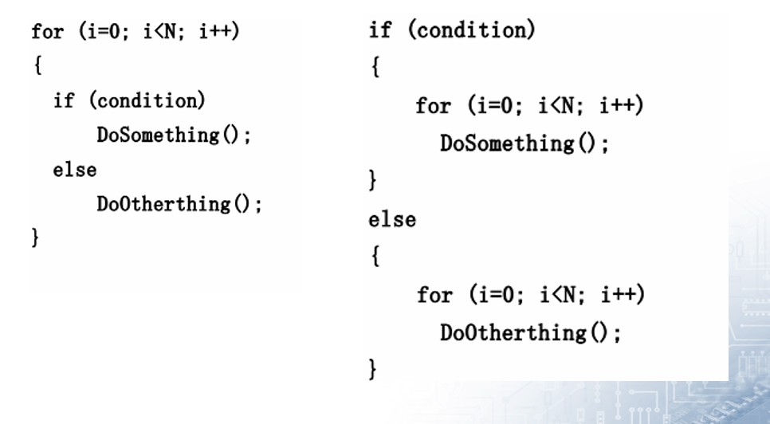

+++
author = "coucou"
title = "嵌软笔试面试——经典题"
date = "2023-08-01"
description = "嵌软笔试面试常考题目"
categories = [
    "嵌软笔试面试"
]
tags = [
    "嵌软笔试面试"
]
+++


## 嵌软笔试面试——经典题

### 零值

>1、请填写 bool , float, 指针变量 与“零值”比较的 if语句。
>
>提示：这里“零值”可以是 0, 0.0 , FALSE 或者“空指针”。例如 int 变量 n 与“零值”比较的 if 语句为： if ( n == 0 )   if ( n != 0 ) 以此类推。
>
>**（1）** 请写出 bool flag 与“零值”比较的 if 语句：
>
>【标准答案】if ( flag )  if ( !flag )
>
>**如下写法不得分**
>
>if(flag == TRUE)  ||  if(flag == 1)  \||  if(flag == FLASE)  ||  if(flag == 0)
>
>**（2）**请写出 float x 与“零值”比较的 if 语句：
>
>【标准答案】 const float EPSINON = 0.00001; if ((x >= - EPSINON) && (x <= EPSINON)
>
>不可将浮点变量用“==”或“！=”与数字比较，应该设法转化成“>=”或“<=”此类形式。
>
>**如下写法不得分**
>
>if( x == 0.0)   ||  if(x != 0.0)
>
>**（3）** 请写出 char *p 与“零值”比较的 if 语句
>
>【标准答案】 if (p == NULL)       if (p != NULL)
>
>**如下写法不得分**
>
>if(p == 0)   ||   if(p)

### sizeof计算

>以下为 Linux下的 32 位 C程序，请计算 sizeof 的值。
>
>char str[] = “Hello” ; char *p = str ;   int   n = 10;
>
>请计算
>
>（1）sizeof (str ) =                     （2）sizeof ( p ) =
>
>（3） sizeof ( n ) =
>
>【标准答案】（1）6、（2）4、（3）4
>
>（4） void Func ( char str[100]){}
>
>请计算 sizeof( str ) =
>
>（5） void *p = malloc( 100 );
>
>请计算sizeof ( p ) =
>
>【标准答案】（4）4、（5）4

### 变量定义

>用变量**a**给出下面的定义
>
>e)   一个有10个指针的数组，该指针是指向一个整型数的;
>
>f)   一个指向有10个整型数数组的指针 ;
>
>g)   一个指向函数的指针，该函数有一个整型参数并返回一个整型数;
>
>h)   一个有10个指针的数组，该指针指向一个函数，该函数有一个整型参数并返回一个整型数;
>
>【标准答案】
>
>e)int * a[10];        
>
>f)int (*a)[10] *
>
>*g)int (*a)(int);     
>
>h) int (*a[10])(int)

### 分析代码

>**设有以下说明和定义：**
>
>```c
>typedef union {
>    long i; int k[5]; char c;
>} DATE; 
>struct data { 
>    int cat; DATE cow; double dog;                       
>} too; DATE max;
>```
>
>则语句 printf("%d",sizeof(struct date)+sizeof(max));的执行结果是：        
>
>【标准答案】DATE是一个union, 变量公用空间. 里面最大的变量类型是int[5], 占用20个字节. 所以它的大小是20
>
>data是一个struct, 每个变量分开占用空间. 依次为int4 + DATE20 + double8 = 32.
>
>所以结果是 20 + 32 = 52.
>
>当然...在某些16位编辑器下, int可能是2字节,那么结果是 int2 + DATE10 + double8 = 20

>**请问以下代码有什么问题：** 
>
>```c
>int main()
>{
>    char a;
>    char *str=&a; 
>    strcpy(str,"hello");
>    printf(str);
>    return 0;
>}
>```
>
>【标准答案】没有为str分配内存空间，将会发生异常问题出在将一个字符串复制进一个字符变量指针所指地址。虽然可以正确输出结果，但因为越界进行内在读写而导致程序崩溃。

>请问以下代码有什么问题： 
>
>```c
>char* s="AAA";
>printf("%s",s);
>s[0]='B';
>printf("%s",s);
>```
>
>有什么错？
>
>【标准答案】"AAA"是字符串常量。s是指针，指向这个字符串常量，所以声明s的时候就有问题。
>
>cosnt char* s="AAA";
>
>然后又因为是常量，所以对是s[0]的赋值操作是不合法的。

```c
void getmemory(char *p)
{
	p=(char *) malloc(100); strcpy(p,“hello world”);
}
int main( )
{
    char *str=NULL; getmemory(str); printf(“%s/n”,str); 		     free(str);
    return 0;
}
// 会出现什么问题？
答案: 程序崩溃，getmemory中的malloc 不能返回动态内存， free（）对str操作很危险。
    
void main()
{
	char aa[10];
     printf(“%d”,strlen(aa));
}
// 会出现什么问题？打印结果是是多少？
【标准答案】sizeof()和初不初始化，没有关系，strlen()和初始化有关，打印结果值未知。
```

```c
char szstr[10]; 
strcpy(szstr,"0123456789"); 
// 产生什么结果？为什么？
【标准答案】长度不一样，出现段错误。
```

> 请简述以下两个 for 循环的优缺点。




### 数组和链表的区别

>数组：数据顺序存储，固定大小；
>
>链表：数据可以随机存储，大小可动态改变

### 解释代码

> int (*s[10])(int) 表示的是什么啊
>
>【标准答案】int (*s[10])(int) 函数指针数组，每个指针指向一个int func(int param)的函数。

>c和c++中的struct有什么不同？
>
>【标准答案】c和c++中struct的主要区别是c中的struct 不可以含有成员函数，而c++中的struct可以。c++中struct和class的主要区别在于默认的存取权限不同， struct默认为public，而class默认为private

>```c
>int main()
>{
>	int x=3; 
>	printf("%d",x); 
>	return 1;
>}
>// 问函数既然不会被其它函数调用，为什么要返回1？
>【标准答案】mian中，c标准认为0表示成功，非0表示错误。具体的值是某中具体出错信息。
>```

### struct计算

```c
struct A
{
    char t:4; 
    char k:4;
    unsigned short i:8;
    unsigned long m;
};
// 问sizeof(A) = ?
【标准答案】8

struct name1{
     char str;
	short x; int num;
}；
// 求sizeof(name1)?
【标准答案】8
    
struct name2{ 
    char str;
    int num; 
    short x;
};
// 求sizeof(name2)？
【标准答案】12
```

### 分析(指针)

```c
// 程序哪里有错误
wap( int* p1,int* p2 )
{
    int *p;
    *p = *p1;
    *p1 = *p2;
    *p2 = *p;
}
【标准答案】p为野指针
    
(void *)ptr 和 (*(void**))
//ptr的结果是否相同？其中ptr为同一个指针。
【标准答案】(void *)ptr 和 (*(void**))ptr值是相同的
```

### 指针

```c
/* 要对绝对地址0x100000赋值，我们可以用(unsigned int*)0x100000 = 1234;
那么要是想让程序跳转到绝对地址是0x100000去执行，应该怎么做？ */

【标准答案】*((void (*)( ))0x100000 ) ( );
首先要将0x100000强制转换成函数指针,即: (void (*)())0x100000
然后再调用它:
*((void (*)())0x100000)();


/* 嵌入式系统经常具有要求程序员去访问某特定的内存位置的特点。在某工程中，要求设置一绝对地址为0x67a9的整型变量的值为0xaa66。编译器是一个纯粹的ANSI编译器。写代码去完成这一任务。 */
【参考答案】这一问题测试你是否知道为了访问一绝对地址把一个整型数强制转换（typecast）为一指针是合法的。这一问题的实现方式随着个人风格不同而不同
。典型的类似代码如下：
int *ptr;
ptr = (int *)0x67a9;
*ptr = 0xaa55;
```

### 内存分析

>堆栈溢出一般是由什么原因导致的？
>
>【标准答案】没有回收垃圾资源。 

> 关于内存的思考题（1）你能看出有什么问题？


### volatile

>**关键字volatile有什么含意? 并给出三个不同的例子。**
>
>【参考答案】一个定义为volatile的变量是说这变量可能会被意想不到地改变，这样，编译器就不会去假设这个变量的值了。精确地说就是，优化器在用到这个变量时必须每次都小心地重新读取这个变量的值，而不是使用保存在寄存器里的备份。下面是volatile变量的几个例子：
>
>1).  并行设备的硬件寄存器（如：状态寄存器）
>
>2).  一个中断服务子程序中会访问到的非自动变量
>
>3).  多线程应用中被几个任务共享的变量

>**关键字volatile有什么含意？**
>
>【标准答案】提示编译器对象的值可能在编译器未监测到的情况下改变。

### 头文件

>**头文件中的 ifndef/define/endif 干什么用？**
>
>【标准答案】防止该头文件被重复引用。

>**\#include <filename.h>  和 #include “filename.h” 有什么区别？**
>
>【标准答案】对于#include <filename.h> ，编译器从标准库路径开始搜索 filename.h ;
>
>对于#include “filename.h” ，编译器从用户的工作路径开始搜索 filename.h 。

>**如何引用一个已经定义过的全局变量？**
>
>【标准答案】可以用引用头文件的方式，也可以用extern关键字，如果用引用头文件方式来引用某个在头文件中声明的全局变理，假定你将那个变量写错了
>
>，那么在编译期间会报错，如果你用extern方式引用
>
>时，假定你犯了同样的错误，那么在编译期间不会报错，而在连接期间报错。

>**全局变量可不可以定义在可被多个.C文件包含的头文件中？为什么？**
>
>【标准答案】可以，在不同的C文件中以static形式来声明同名全局变量。可以在不同的C文件中声明同名的全局变量，前提是其中只能有一个C文件中对此变量赋初值，此时连接不会出错。

### const & static

>**const 有什么用途？（请至少说明两种）**
>
>【标准答案】： 
>
>（1）可以定义 const 常量
>
>（2）const 可以修饰函数的参数、返回值，甚至函数的定义体。被 const 修饰的东西都受到强制保护，可以预防意外的变动，能提高程序的健壮性。

>**static有什么用途？（请至少说明两种）**
>
>【标准答案】
>
>1. 限制变量的作用域（static全局变量）；
>2. 设置变量的存储域（static局部变量）。

> **A.c 和B.c两个c文件中使用了两个相同名字的static变量,编译的时候会不会有问题?这两个static变量会保存到哪里（栈还是堆或者其他的）?**
>
>【标准答案】static的全局变量，表明这个变量仅在本模块中有意义，不会影响其他模块。
>
>他们都放在静态数据区，但是编译器对他们的命名是不同的。
>
>如果要使变量在其他模块也有意义的话，需要使用extern关键字。

>**static全局变量与普通的全局变量有什么区别？**
>
>【标准答案】 static全局变量只初使化一次，防止在其他文件单元中被引用;
>
>**static局部变量和普通局部变量有什么区别**
>
>【标准答案】static局部变量只被初始化一次，下一次依据上一次结果值；
>
>**static函数与普通函数有什么区别？**
>
>【标准答案】static函数在内存中只有一份，普通函数在每个被调用中维持一份拷贝

### 堆栈

>**队列和栈有什么区别？**
>
>【标准答案】队列先进先出，栈后进先出。

> **Heap与stack的差别。**
>
>【标准答案】Heap是堆，stack是栈。
>
>Stack的空间由操作系统自动分配/释放，Heap上的空间手动分配/释放。Stack空间有限，Heap是很大的自由存储区C中的malloc函数分配的内存空间即在堆上,C++中对应的是new操作符。程序在编译期对变量和函数分配内存都在栈上进行,且程序运行过程中函数调用时参数的传递也在栈上进行

>程序的局部变量存在于**栈(stack)**中，全局变量存在于**静态数据区** 中，动态申请数据存在于**堆（ heap）**中。

>**用两个栈实现一个队列的功能？要求给出算法和思路！**
>
>【参考答案】设2个栈为A,B, 一开始均为空. 入队:
>
>将新元素push入栈A; 出队:
>
>(1) 判断栈B是否为空；
>
>(2) 如果不为空，则将栈A中所有元素依次pop出并push到栈B；
>
>(3) 将栈B的栈顶元素pop出；

### 宏&编译

>**用宏定义写出swap（x，y），即交换两数。**
>
>【标准答案】
>
>\#define swap(x, y) (x)=(x)+(y);(y)=(x)–(y);(x)=(x)–(y);

>**写一个“标准”宏，这个宏输入两个参数并返回较小的一个。**
>
>【标准答案】#define Min(X, Y) ((X)>(Y)?(Y):(X))//结尾没有;
>
>**用预处理指令#define 声明一个常数，用以表明1年中有多少秒（忽略闰年问题）**
>
>【参考答案】#define SECONDS_PER_YEAR (60 * 60\* 24 * 365)UL

>**已知一个数组table，用一个宏定义，求出数据的元素个数。**
>
>【标准答案】
>
>\#define NTBL(table) (sizeof(table)/sizeof(table[0]))

>**什么是预编译，何时需要预编译：**
>
>【标准答案】１、总是使用不经常改动的大型代码体。
>
>２、程序由多个模块组成，所有模块都使用一组标准的包含文件和相同的编译选项。在这种情况下，可以将所有包含文件预编译为一个预编译头。

>**Typedef 在C语言中频繁用以声明一个已经存在的数据类型的同义字。也可以用预处理器做类似的事。例如，思考一下下面的例子：**
>
>\#define dPS struct s * typedef struct s * tPS;
>
>以上两种情况的意图都是要定义dPS 和 tPS 作为一个指向结构s指针。哪种方法更好呢？（如果有的话）为什么？
>
>【参考答案】这是一个非常微妙的问题，任何人答对这个问题（正当的原因）是应当被恭喜的。答案是：typedef更好。思考下面的例子：
>
>dPS p1,p2; tPS p3,p4;
>
>第一个扩展为
>
>struct s * p1, p2;
>
>上面的代码定义p1为一个指向结构的指，p2为一个实际的结构，这也许不是你想要的。第二个例子正确地定义了p3 和p4 两个指针。

### extern “C”

>**在 C++ 程序中调用被 C 编译器编译后的函数， 为什么要加 extern “C”？**
>
>【标准答案】C++语言支持函数重载，C 语言不支持函数重载。函数被 C++编译后在库中的名字与 C 语言的不同。假设某个函数的原型为： void foo(int x, int y); 该函数被 C 编译器编译后在库中的名字为_foo，而C++编译器则会产生像_foo_int_int 之类的名字。 C++ 提供了 C 连接交换指定符号 extern“C”来解决名字匹配问题。

### 代码分析2

```c
// 1. 请写出下列代码的输出内容#include <stdio.h>
int main()
{
    int a,b,c,d; a=10;
    b=a++; c=++a; d=10*a++;
    printf("b，c，d：%d，%d，%d"，b，c，d）;
    return 0;
}
【标准答案】10，12，120
           
unsigned char *p1; unsigned long *p2;
p1=(unsigned char *)0x801000; p2=(unsigned long *)0x810000; 
// 2. 请问p1+5= ;   p2+5= ;
【标准答案】0x801005、0x810020
           
void main()
{
    int a[5]={1,2,3,4,5};
    int *ptr=(int *)(&a+1); 
    printf(“%d，%d”,*(a+1),*(ptr-1));
}
// 3. 请问输出：
【标准答案】2,5
      
// 4. 以下是求一个数的平方的程序,请找出错误: #define SQUARE(a)((a)*(a))
int a=5; int b;
b=SQUARE(a++);
【标准答案】宏在预编译时会以替换的形式展开，仅仅会替换。涉及到宏的地方，不要用++ --，标准中对此没有规定，因此最终结果将会依赖于不同的编译器。执行程序的答案可能是25、也有可能是36。
           
#define Max_CB 500
void LmiQueryCSmd(Struct MSgCB * pmsg)
{
    unsigned char ucCmdNum;
    ......
    for(ucCmdNum=0;ucCmdNum<Max_CB;ucCmdN um++)
    {
        ......;
    }
}
// 5. 这段代码执行有什么问题？
【标准答案】死循环
unsigned char //无符号字符型 表示范围0~255 char //有符号字符型 表示范围-128~127

int modifyvalue()
{
    return(x+=10);
}
int changevalue(int x)
{
    return(x+=1);
}
void main()
{
    int x=10; x++;
    changevalue(x); x++;
    modifyvalue();
    printf("First output:%dn",x); x++;
    changevalue(x); printf("Second output:%dn",x); modifyvalue();
    printf("Third output:%dn",x);
}
// 6. 输出?
【 标准答案】12、13、13

// 7. 请写出下列代码的输出内容
＃include<stdio.h> main()
{
    int a,b,c,d; a=10;
    b=a++; c=++a; d=10*a++;
    printf("b，c，d：%d，%d，%d"，b，c，d）;
    return 0;
}
【标准答案】10，12，120
```

>8. 找出程序的错误


```c
// 9. 下面的代码输出是什么，为什么？ 
void foo(void)
{
    unsigned int a = 6; int b = -20;
    (a+b > 6)? puts("> 6") : puts("<= 6");
}
【参考答案】这个问题测试你是否懂得C语言中的整数自动转换原则，
我发现有些开发者懂得极少这些东西。不管如何，这无符号整型问题的答案是输出是“>6”。原因是当表达式中存在有符号类型和无符号类型时所有的数都自动转换为无符号类型。因此-20变成了一个非常大的正整数，所以该表达式计算出的结果大于6。这一点对于应当频繁用到无符号数据类型的嵌入式系统来说是丰常重要的。如果你答错了这个问题，你也就到了得不到这份工作的边缘。

```

### other

```c
// 1. 一语句实现x是否为2的若干次幂的判断。
void main()
{
    int a; scanf(“%d”,&a);
    printf(“%c”,(a)&(a-1)?’n’:’y’); //  若是打印y，否则n
}

// 2. 中断是嵌入式系统中重要的组成部分，这导致了很多编译开发商提供一种扩展—让标准C支持中断。具代表事实是，产生了一个新的关键字interrupt。下面的代码就使用了	interrupt关键字去定义了一个中断服务子程序(ISR)，请评论一下这段代码的。
interrupt double compute_area (double radius)
{
double area = PI * radius * radius; printf(" Area = %f", area);
return area;
}
【参考答案】这个函数有太多的错误了，以至让人不知从何说起了：
1).	ISR 不能返回一个值。如果你不懂这个，那么你不会被雇用的。
2).	ISR 不能传递参数。如果你没有看到这一点，你被雇用的机会等同第一项。
3).	在许多的处理器/编译器中，浮点一般都是不可重入的。有些处理器/编译器需要让额处的寄存器入栈，有些处理器/编译器就是不允许在ISR中做浮点运算。此外，ISR应该是短而有效率的，在ISR中做浮点运算是不明智的。
4).	与第三点一脉相承，printf()经常有重入和性能上的问题。如果你丢掉
了第三和第四点，我不会太为难你的。不用说，如果你能得到后两点，那么你的被雇用前景越来越光明了
```

### 代码编写

```c
// 1. 编写 strcpy 函数, 已知 strcpy 函数的原型是 char *strcpy(char *strDest, const char *strSrc);其中 strDest 是目的字符串， strSrc 是源字符串。
（1）	不调用 C++/C 的字符串库函数，请编写函数
strcpy 。

（2）	strcpy 能把 strSrc 的内容复制到 strDest，为什么还要 char * 类型的返回值？

// 2. 请编写一个 C 函数，该函数给出一个字节中被置 1 的位的个数。
unsigned int TestAsOne0(char log)
{
    int i;
    unsigned int num=0, val; for(i=0; i<8; i++)
    {
        val = log >> i; //移位val &= 0x01; //与1相与if(val)
        num++;
    }
    return num;
}

// 3. 实现strcmp函数


// 4. 华为面试题：怎么判断链表中是否有环？
【参考答案】答：用两个指针来遍历这个单向链表，第一个指针p1，每次走一步；第二个指针p2，每次走两步； 当p2 指针追上 p1的时候，就表明链表当中有环路了。
int	testLinkRing(Link *head)
{
    Link *t1=head,*t2=head; while( t1->next && t2->next)
    {
        t1 = t1->next;
        if (NULL == (t2 = t2->next->next)) return 0;	//无环
        if (t1 == t2)
        return 1;
    }
    return 0;
}

// 5. 实现双向链表删除一个节点P，在节点P后插入一个节点，写出这两个函数。


// 6. 把一个链表反向 。
【参考答案】从第一个元素开始，ps指向他，将他（ps）指向头节点(ps->next= head)，将ps设为头节点（head = ps;）操作下一个元素（ps = pe->next;）等于是依次将每个元素翻到原头节点前面。

// 7. 取一个整数a从右端开始的4～7位。
void main()
{
	unsigned a,b,c,d; 
    scanf("%o",&a); 
    b=a>>4; c=~(~0<<4);
	d=b&c; 
    printf("%o\n%o\n",a,d);
}
```

