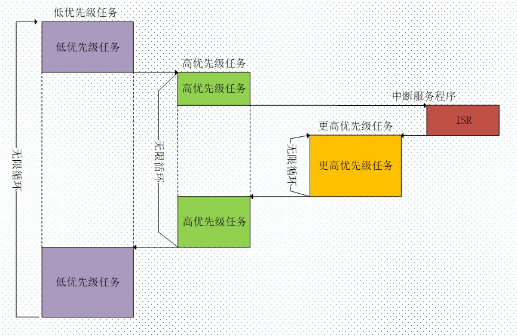
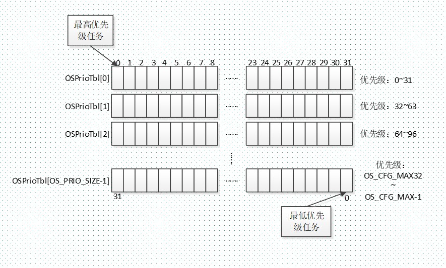
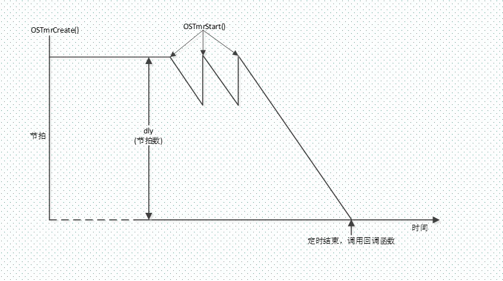
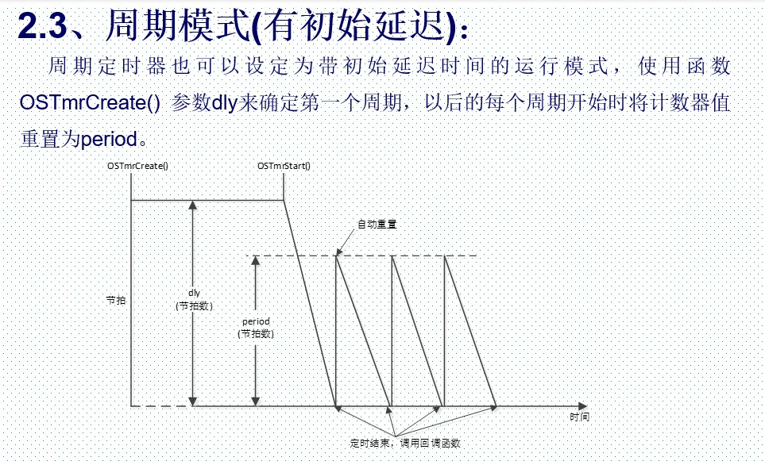
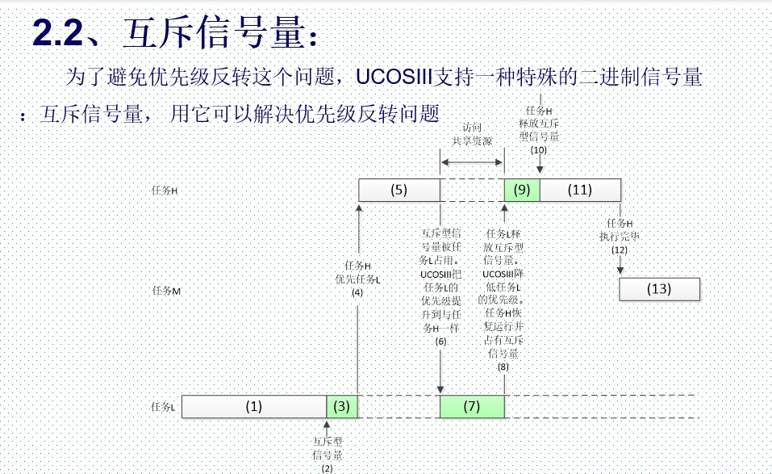
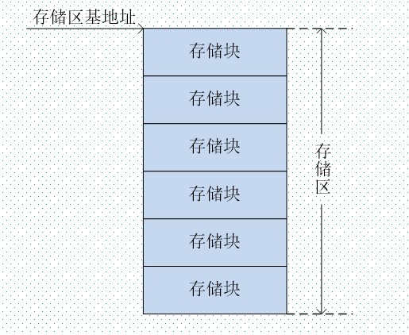
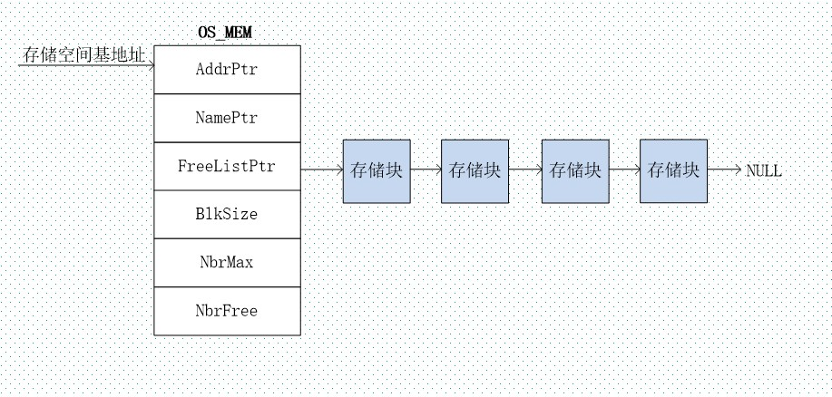

+++
author = "coucou"
title = "操作系统——UCOS3"
date = "2023-08-01"
description = "操作系统专题之UCOS3"
categories = [
    "操作系统"
]
tags = [
    "操作系统","UCOS3"
]
+++


## 实时操作系统之UCOS3

### 简介

> RTOS的内核负责管理所有的任务，内核决定了运行哪个任务，何时停止当前任务切换到其他任务，这个是内核的多任务管理能力。多任务管理给人的感觉就好像芯片有多个CPU，多任务管理实现了CPU资源的最大化利用，多任务管理有助于实现程序的模块化开发，能够实现复杂的实时应用。		
>
> RTOS操作系统：**UCOS，FreeRTOS，RTX，RT-Thread，DJYOS**等



### 任务管理

#### 延时函数

|       **函数**        |                     **描述**                     |
| :-------------------: | :----------------------------------------------: |
|  delay_osschedlock()  |    任务调度器加锁，对UCOS中的对应函数做封装。    |
| delay_osschedunlock() |    任务调度器解锁，对UCOS中的对应函数做封装。    |
|   delay_ostimedly()   | 延时，按照节拍数延时，对UCOS中的对应函数做封装。 |
|   SysTick_Handler()   |             滴答定时器中断服务函数。             |
|     delay_init()      |             滴答定时器/延时初始化。              |
|      delay_us()       |           微秒延时，不会引发任务调度。           |
|      Delay_ms()       |   毫秒延时，最小ms延时时间为UCOS系统心跳时间。   |

#### 任务组成

>UCOSIII中的任务由三部分组成：**任务堆栈、任务控制块和任务函数**。
>
>任务堆栈：上下文切换的时候用来保存任务的工作环境，就是STM32的内部寄存器值
>
>任务控制块：任务控制块用来记录任务的各个属性
>
>任务函数：由用户编写的任务处理代码

#### 系统任务

>UCOSIII默认有5个系统任务：
>
>**空闲任务**
>
>1、空闲任务是UCOSIII创建的第一个任务。
>
>2、空闲任务是UCOSIII必须创建的。
>
>3、空闲任务优先级总是为OS_CFG_PRIO_MAK-1。
>
>4、空闲任务中不能调用任何可使空闲任务进入等待态的函数！
>
>**时钟节拍任务**
>
>时钟节拍任务用来跟踪任务延时和任务等待超时，任务函数为OS_TickTask()，是UCOSIII必须创建的一个任务，任务优先级用宏OS_CFG_TICK_TASK_PRIO来定义 ，一般时钟节拍任务的任务应该设置一个相对较高的优先级。
>
>**统计任务**
>
>可选任务，用来统计CPU使用率和各个任务的堆栈使用量。此任务是可选任务，由宏OS_CFG_STAT_TASK_EN控制是否使用此任务。使用步骤：
>
>1、将宏OS_CFG_STAT_TASK_EN置1。
>
>2、必须在main函数创建的以一个任务也是唯一的一个应用任务里面调用函数OSStatTaskCPUUsageInit()。
>
>3、统计任务的优先级通过宏OS_CFG_STAT_TASK_PRIO来设置，一般设置OS_CFG_PRIO_MAX-2,也就是倒数第二个优先级。
>
>**定时任务**
>
>UCOSIII提供软件定时器功能，定时任务是可选的，将宏OS_CFG_TMR_EN设置为1就会使能定时任务，在OSInit()中将会调用函数**OS_TmrInit()**来创建定时任务。定时任务的优先级通过宏OS_CFG_TMR_TASK_PRIO定义，ALIENTEK默认将定时器任务优先级设置为2。
>
>**中断服务管理任务**
>
>当把os_cfg.h文件中的宏OS_CFG_ISR_POST_DEFERRED_EN置1就会使能中断服务管理任务，**当ISR(中断服务函数)调用UCOSIII提供的“post”函数时，要发送的数据和发送的目的地都会存入一个特别的缓冲队列中，当所有嵌套的ISR都执行完成以后UCOSIII会做任务切换，运行中断服务管理任务，该任务会把缓存队列中存放的信息重发给相应的任务**。这样做的好处就是可以减少中断关闭的时间，否则，在ISR中还需要把任务从等待列表中删除，并把任务放入就绪表，以及做一些其他的耗时操作。
>
>中断服务管理任务的优先级永远为0，不可更改！

```c
钩子函数一般主要是用来扩展其他函数(任务)功能的，钩子函数有如下几个：
    1、OSIdleTaskHook()，空闲任务调用这个函数，可以用来让CPU进入低功耗模式
    2、OSInitHook()，系统初始化函数OSInit()调用此函数。
    3、OSStatTaskHook(),统计任务每秒中都会调用这个函数，此函数允许你向统计任务中添加自己的应用函数。
    4、OSTaskCreateHook(),任务创建的钩子函数。
    5、OSTaskDelHook(),任务删除的钩子函数。
    6、OSTaskReturnHook(),任务意外返回时调用的钩子函数，比如删除某个任务
    7、OSTaskSwHook(),任务切换时候调用的钩子函数。
    8、OSTimeTickHook()，滴答定时器调用的钩子函数。
```

#### 任务状态

>  1、休眠态：任务已经在CPU的flash中了，但是还不受UCOSIII管理。
>
>  2、就绪态：系统为任务分配了任务控制块，并且任务已经在就绪表中登记，这时这个任务就具有了运行的条件，此时任务的状态就是就绪态。
>
>  3、运行态：任务获得CPU的使用权，正在运行。
>
>  4、等待态：正在运行的任务需要等待一段时间，或者等待某个事件，这个任务就进入了等待态，此时系统就会把CPU使用权转交给别的任务。
>
>  5、中断服务态：当发送中断，当前正在运行的任务会被挂起，CPU转而去执行中断服务函数，此时任务的任务状态叫做中断服务态。


#### 任务堆栈的创建

>任务堆栈是任务的重要部分，堆栈是在RAM中按照“先进先出(FIFO)”的原则组织的一块连续的存储空间。为了满足任务切换和响应中断时保存CPU寄存器中的内容及任务调用其它函数时的需要，每个任务都应该有自己的堆栈。
>
>\#define START_STK_SIZE  512 //堆栈大小
>
>CPU_STK START_TASK_STK[START_STK_SIZE]; //定义一个数组来作为任务堆栈
>
>CPU_STK为CPU_INT32U类型，也就是unsigned int类型，为4字节的，那么任务堆栈START_TASK_STK的大小就为：512 X 4=2048字节!

```c
// 任务堆栈的初始化,用户一般不会直接操作堆栈初始化函数，任务堆栈初始化函数由任务创建函数OSTaskCreate()调用。不同的CPU对于的寄存器和对堆栈的操作方式不同，因此在移植UCOSIII的时候需要用户根据各自所选的CPU来编写任务堆栈初始化函数。
CPU_STK  *OSTaskStkInit (OS_TASK_PTR    p_task,
                         void          *p_arg,
                         CPU_STK       *p_stk_base,
                         CPU_STK       *p_stk_limit,
                         CPU_STK_SIZE   stk_size,
                         OS_OPT         opt)
// 任务创建
void  OSTaskCreate (OS_TCB        *p_tcb,
                    CPU_CHAR      *p_name,
                    OS_TASK_PTR    p_task,
                    void          *p_arg,
                    OS_PRIO        prio,
                    CPU_STK       *p_stk_base, 	//任务堆栈基地址
                    CPU_STK_SIZE   stk_limit,	//任务堆栈栈深
                    CPU_STK_SIZE   stk_size,	//任务堆栈大小
                    OS_MSG_QTY     q_size,
                    OS_TICK        time_quanta,
                    void          *p_ext,
                    OS_OPT         opt,
                    OS_ERR        *p_err)
// 函数OSTaskCreate()中的参数p_stk_base是任务堆栈基地址，那么如果CPU的堆栈是向上增长的话那么基地址就&START_TASK_STK[0],如果CPU堆栈是向下增长的话基地址就是&START_TASK_STK[START_STK_SIZE-1]STM32的堆栈是向下增长的！
```

#### 任务控制块

>任务控制块是用来记录与任务相关的信息的数据结构，每个任务都要有自己的任务控制块。任务控制块由用户自行创建，如下代码为创建一个任务控制块：
>
>OS_TCB StartTaskTCB;    //创建一个任务控制块
>
>OS_TCB为一个结构体，描述了任务控制块，任务控制块中的成员变量用户不能直接访问，更不可能改变他们。

#### 任务优先级和就绪表

>UCOSIII中任务优先级数由宏OS_CFG_PRIO_MAX来配置，UCOSIII中数值越小，优先级越高，最低可用优先级就是OS_CFG_PRIO_MAX-1。
>
>UCOSIII中就绪表由2部分组成：
>
>1、优先级位映射表OSPrioTbl[]：用来记录哪个优先级下有任务就绪。
>
>2、就绪任务列表OSRdyList[]：用来记录每一个优先级下所有就绪的任务。




#### 任务调度

>**任务级调度器**为函数OSSched()。
>
>**中断级调度器**为函数OSIntExit()，当退出外部中断服务函数的时候使用中断级任务调度。
>
>**任务调度点**
>
>1、释放信号量或者发送消息，也可通过配置相应的参数不发生任务调度。
>
>2、使用延时函数OSTimeDly()或者OSTimeDlyHMSM()。
>
>3、任务等待的事情还没发生(等待信号量，消息队列等)。
>
>4、任务取消等待。
>
>5、创建任务。
>
>6、删除任务。
>
>7、删除一个内核对象。
>
>8、任务改变自身的优先级或者其他任务的优先级。
>
>9、任务通过调用OSTaskSuspend()将自身挂起。
>
>10、任务解挂某个挂起的任务。
>
>11、退出所有的嵌套中断。
>
>12、通过OSSchedUnlock()给调度器解锁。
>
>13、任务调用OSSchedRoundRobinYield()放弃其执行时间片。
>
>14、用户调用OSSched()。
>
>**任务调度上锁和解锁**
>
>有时候我们并不希望发生任务调度，因为始终有一些代码的执行过程是不能被打断的。此时我们就可以使用函数OSSchedLock()对调度器加锁，当我们想要恢复任务调度的时候就可以使用函数OSSchedUnlock()给已经上锁的任务调度器解锁

#### 时间片轮转调度

>UCOSIII允许一个优先级下有多个任务，每个任务可以执行指定的时间(时间片)，然后轮到下一个任务，这个过程就是时间片轮转调度，当一个任务不想在运行的时候就可以放弃其时间片。
>
>时间片轮转调度器为：OS_SchedRoundRobin()。

| **任务** | **时间片数** |
| :------: | :----------: |
|  Task1   |      4       |
|  Task2   |      4       |
|  Task3   |      4       |


#### 任务切换

>当UCOSIII需要切换到另外一个任务时，它将保存当前任务的现场到当前任务的堆栈中，主要是CPU寄存器值，然后恢复新的现场并且执行新的任务，这个过程就是任务切换。
>
>任务切换分为两种：**任务级切换和中断级切换**。
>
>任务级切换函数为：OSCtxSw()。
>
>中断级切换函数为：OSIntCtxSw()。

#### 系统初始化

```c
// 在使用UCOSIII之前我们必须先初始化UCOSIII，函数OSInit()用来完成UCOSIII的初始化，而且OSInit()必须先于其他UCOSIII函数调用，包括OSStart()。
int main(void)
{
   OS_ERR err;
   ……
   //其他函数，一般为外设初始化函数
   ……
   OSInit(&err);
   ……
   //其他函数，一般为创建任务函数
   ……
   OSStart(&err);
}
```

### 任务创建和删除

```c
// 任务创建
void  OSTaskCreate (	OS_TCB        	*p_tcb,
                    	    	CPU_CHAR      	*p_name,
                    		OS_TASK_PTR    p_task,
                    		void          	*p_arg,
                    		OS_PRIO        	prio,
                    		CPU_STK       	*p_stk_base,
                    		CPU_STK_SIZE   stk_limit,
                    		CPU_STK_SIZE   stk_size,
                    		OS_MSG_QTY     q_size,
                    		OS_TICK        	time_quanta,
                    		void          	*p_ext,
                    		OS_OPT         	opt,
                    		OS_ERR        	*p_err)
// 任务删除
void  OSTaskDel (OS_TCB  *p_tcb,
                 OS_ERR  *p_err)
// 任务挂起
void   OSTaskSuspend ( OS_TCB  *p_tcb,
                       OS_ERR  *p_err)
// 任务恢复 
void  OSTaskResume (OS_TCB  *p_tcb,
                    OS_ERR  *p_err)

```

### 时间片轮转调度

>时间片轮转调度器用于时间片轮转调度，为函数OS_SchedRoundRobin(), 此函数由OSTimeTick或者OS_IntQTask()调用，函数在文件os_core.c中定义
>
>如果我们想要使用UCOSIII的时间片轮转调度的话不仅要将宏**OS_CFG_SCHED_ROUND_ROBIN_EN**置1

```c
// 轮转调度配置
void  OSSchedRoundRobinCfg (CPU_BOOLEAN   en,
                            OS_TICK  dflt_time_quanta,
                            OS_ERR       *p_err)
// 放弃本次时间片
void  OSSchedRoundRobinYield (OS_ERR  *p_err)

```

### 中断和时间管理

#### 中断

```c
// 例，串口中断处理
void USART1_IRQHandler(void)
{
      OSIntEnter();
      //中断服务程序
      OSIntExit();
}  

void  OSIntEnter (void)
{
      if (OSRunning != OS_STATE_OS_RUNNING) {
	  return
      }
      if (OSIntNestingCtr >= (OS_NESTING_CTR)250u) {
            return; 
      }
     OSIntNestingCtr++; // OSIntNestingCtr来记录中断嵌套次数，UCOSIII最多支持250级的中断嵌套。退出中断服务函数时要调用函数						    OSIntExit()。
}
```

#### 临界断代码保护

>临界段代码也叫做**临界区**，是指那些必须完整连续运行，不可被打断的代码段。当访问这些临界段代码的时候需要对这些临界段代码进行保护。
>
> 当宏**OS_CFG_ISR_POST_DEFERRED_EN**为0时，UCOSIII使用关中断的方式来保护临界段代码，当设置为1的时候就会采用给调度器上锁的方式来保护临界段代码。
>
>UCOSIII定义了一个进入临界段代码的宏：**OS_CRITICAL_ENTER()**，定义了两个退出临界段代码的宏：**OS_CRITICAL_EXIT()**和OS_CRITICAL_EXIT_NO_SCHED()。

#### 任务延时

>UCOSIII中的任务是一个无限循环并且还是一个抢占式内核，为了使高优先级的任务不至于独占CPU，可以给其他优先级较低任务获取CPU使用权的机会，UCOSIII中除空闲任务外的所有任务必须在合适的位置调用系统提供的延时函数，**让当前的任务暂停运行一段时间并进行一个任务切换**。
>
>延时函数有两种，OSTimeDly()和OSTimeDlyHMSM()。
>
>OSTimeDly()函数有三种工作模式：相对模式、周期模式和绝对模式。
>
>OSTimeDlyHMSM()函数仅在相对模式下工作。
>
>**延时任务**可通过在其他任务中调用函数**OSTimeDlyResume()**取消延时而进入就绪状态，此函数最后会引发一次任务调度。

#### 获取和设置系统时间

>UCOSIII定义了一个**CPU_INT32U**类型的全局变量**OSTickCtr**来记录系统时钟节拍数，在调用OSInit()时被初始化为0，以后每发生1个时钟节拍，OSTickCtr加1。
>
>OSTimeSet()允许用户改变当前时钟节拍计数器的值，慎用！！！！！
>
>OSTimeGet()用来获取动迁时钟节拍计数器的值。

### 软件定时器

>定时器本质是递减计数器，当计数器减到零时可以触发某种动作的执行，这个动作通过回调函数来实现。当定时器计时完成时，定义的回调函数就会被立即调用，应用程序可以有任意数量的定时器，UCOSIII中定时器的时间分辨率由一个宏OS_CFG_TMR_TASK_RATE_HZ，单位为HZ，默认为100Hz。

|    **函数名**    |         **作用**         |
| :--------------: | :----------------------: |
|  OSTmrCreate()   | 创建定时器并制定运行模式 |
|    OSTmrDel()    |        删除定时器        |
| OSTmrRemainGet() |   获取定时器的剩余时间   |
|   OSTmrStart()   |      启动定时器计数      |
| OSTmrStateGet()  |    获取当前定时器状态    |
|   OSTmrStop()    |     停止计数器倒计时     |

```c
// 创建定时器
OSTmrCreate (OS_TMR               *p_tmr,
             CPU_CHAR             *p_name,
             OS_TICK               dly,
             OS_TICK               period,
             OS_OPT                opt,            // 模式
             OS_TMR_CALLBACK_PTR   p_callback,
             void                 *p_callback_arg,
             OS_ERR               *p_err)
```







### 信号量和互斥信号量

#### 信号量

>信号量像是一种上锁机制，代码必须获得对应的钥匙才能继续执行，一旦获得了钥匙，也就意味着该任务具有进入被锁部分代码的权限。一旦执行至被锁代码段，则任务一直等待，直到对应被锁部分代码的钥匙被再次释放才能继续执行。
>
>信号量用于控制**对共享资源的保护**，但是现在基本用来做**任务同步用**。
>
>要想获取资源的任务必须执行**等待**操作，如果该资源对应的信号量有效值大于1，则任务可以获得该资源，任务继续运行。如果该信号量的有效值为0，则任务加入等待信号量的任务表中。如果等待时间超过某一个设定值，该信号量仍然没有被释放掉，则等待信号量的任务就进入就绪态，如果将等待时间设置为0的话任务就将一直等待该信号量
>
>信号量通常分为两种：**二进制信号量和计数型信号量**。
>
>二进制信号量只能取0和1两个值，计数型信号量的信号量值大于1，计数型信号量的范围由**OS_SEM_CTR**决定，OS_SEM_CTR可以为8位，16位和32位，取值范围分别为：0~255,0~65535和0~4294967295。
>
>**二进制信号量**用于那些一次只能一个任务使用的资源，比如I/O设备，打印机计；**计数型信号量**用于某些资源可以同时被几个任务所使用，比如一个缓存池有10个缓存块，那么同时最多可以支持10个任务来使用内存池

|    **函数名**    |        **作用**        |
| :--------------: | :--------------------: |
|  OSSemCreate()   |     建立一个信号量     |
|    OSSemDel()    |     删除一个信号量     |
|   OSSemPend()    |     等待一个信号量     |
| OSSemPendAbrot() |        取消等待        |
|   OSSemPost()    | 释放或者发出一个信号量 |
|    OSSemSet()    | 强制设置一个信号量的值 |

####  互斥信号量




|     **函数名**     |          **作用**          |
| :----------------: | :------------------------: |
|  OSMutexCreate()   |     建立一个互斥信号量     |
|    OSMutexDel()    |     删除一个互斥信号量     |
|   OSMutexPend()    |     等待一个互斥信号量     |
| OSMutexPendAbrot() |          取消等待          |
|   OSMutexPost()    | 释放或者发布一个互斥信号量 |

>在UCOSIII中每个任务都有自己的**内嵌的信号量**，这种功能不仅能够简化代码，而且比使用独立的信号量更有效。任务信号量是直接内嵌在UCOSIII中的，任务信号量相关代码在os_task.c中。

|   OSTaskSemPend()    |   等待一个任务信号量   |
| :------------------: | :--------------------: |
| OSTaskSemPendAbort() |   取消等待任务信号量   |
|   OSTaskSemPost()    |     发布任务信号量     |
|    OSTaskSemSet()    | 强行设置任务信号量计数 |

### 消息传递

>一个任务或者中断服务程序有时候需要和另一个任务交流信息，这个就是消息传递的过程就叫做任务间通信，任务间的消息传递可以通过2种途径：一是通过全局变量，二是通过发布消息。
>
>使用全局变量的时候每个任务或者中断服务程序都必须保证其对全局变量的独占访问。消息也可以通过消息队列作为中介发布给任务。
>
>消息包含一下几个部分：**指向数据的指针，数据的长度和记录消息发布时刻的时间戳**，指针指向的可以是一块数据区域或者甚至是一个函数。 

```c
// 消息队列是UCOSIII中的一个内核对象，为结构体OS_Q
struct  os_q {
OS_OBJ_TYPE         	 Type; 
CPU_CHAR            	*NamePtr; 
OS_PEND_LIST         	PendList;                          
#if OS_CFG_DBG_EN > 0u
    OS_Q                *DbgPrevPtr;
    OS_Q                *DbgNextPtr;
    CPU_CHAR            *DbgNamePtr;
#endif
OS_MSG_Q             	MsgQ	//消息列表
};
// OS_MSG_Q也是一个结构体
struct  os_msg_q {                                           
OS_MSG              *InPtr;   
OS_MSG              *OutPtr; 
OS_MSG_QTY           NbrEntriesSize; 
OS_MSG_QTY           NbrEntries; 
OS_MSG_QTY           NbrEntriesMax;
};
// 消息发布以后会被存放在OS_MSG类型的数据结构中，OS_MSG如下
struct  os_msg {
OS_MSG              *NextPtr;                           
void                *MsgPtr; 
OS_MSG_SIZE          MsgSize; 
CPU_TS               MsgTS;
};
```


|   **函数名**   |        **作用**        |
| :------------: | :--------------------: |
|  OSQCreate()   |   创建一个消息  队列   |
|    OSQDel()    |    删除一个消息队列    |
|   OSQFlush()   |      清空消息队列      |
|   OSQPend()    |        等待消息        |
| OSQPendAbort() |      取消等待消息      |
|   OSQPost()    | 向消息队列发布一则消息 |

>同任务内嵌信号量一样，UCOSIII的每个任务中也有**内建消息队列**。而且多个任务等待同一个消息队列的应用很少见，UCOSIII中每个任务多有其内建消息队列的话用户可以不用通过外部的消息队列而直接向任务发布消息。
>
>如果需要使用任务内建消息队列功能的时候需要将宏**OS_CFG_TASK_Q_EN**置1来使能相关的代码。

|     **函数名**     |      **作用**      |
| :----------------: | :----------------: |
|   OSTaskQPend()    |      等待消息      |
| OSTaskQPendAbort() |    取消等待消息    |
|   OSTaskQPost()    | 向任务发布一则消息 |
|   OSTaskQFlush()   | 清空任务的消息队列 |

### 同时等待多个内核对象

>有时候一个任务需要与多个事件同步，这个时候就需要使用事件标志组。事件标志组与任务之间有两种同步机制：“或”同步和“与”同步。
>
>**“或”同步**：等待多个事件时，任何一个事件发生 ，任务都被同步，这个就称为“或”同步。
>
>**“与”同步**：当所有的事件都发生时任务才被同步，这种同步机制被称为“与”同步。
>
>在UCOSIII中**事件标志组为OS_FLAG_GRP**，如果需要使用事件标志组的时候需要将宏OS_CFG_FLAG_EN置1，

```c
struct  os_flag_grp {
	OS_OBJ_TYPE          Type;                             
	CPU_CHAR             *NamePtr; 
	OS_PEND_LIST         PendList; 
    #if OS_CFG_DBG_EN > 0u
        OS_FLAG_GRP      *DbgPrevPtr;
        OS_FLAG_GRP      *DbgNextPtr;
        CPU_CHAR         *DbgNamePtr;
    #endif
	OS_FLAGS             Flags; 
	CPU_TS               TS;
};
```

|       **函数名**        |         **作用**         |
| :---------------------: | :----------------------: |
|     OSFlagCreate()      |      创建事件标志组      |
|       OSFlagDel()       |      删除事件标志组      |
|      OSFlagPend()       |      等待事件标志组      |
|    OSFlagPendAbort()    |     取消等待事件标志     |
| OSFlagPendGetFlagsRdy() | 获取使任务就绪的事件标志 |
|      OSFlagPost()       |   向事件标志组发布标志   |

>前面我们讲过都是**等待单个内核对象**，包括：信号量、互斥信号量、消息队列和事件标志组。在UCOSIII中允许任务同时等待多个信号量和多个消息队列，也就是说，UCOSIII不支持同时等待多个事件标志组或互斥信号量。
>
>一个任务可以等待任意数量的信号量和消息队列，第一个信号量或消息队列的发布会导致该任务进入就绪态。

```c
// 一个任务可以调用函数OSPendMulti()函数来等待多个对象，并且可以根据需要指定一个等待超时值
OS_OBJ_QTY  OSPendMulti (OS_PEND_DATA   *p_pend_data_tbl,
                         OS_OBJ_QTY     tbl_size,
                         OS_TICK        timeout,
                         OS_OPT         opt,
                         OS_ERR         *p_err)
// 在调用函数OSPendMulti()之前我们需要先初始化OS_PEND_DATA数组，数组的大小取决于任务同时等待的内核对象的总数量

// 定义内核对象
OS_SEM	Test_Sem1;			//信号量1
OS_SEM	Test_Sem2;			//信号量2
OS_Q	Test_Q;				//消息队列

// 初始化OS_PEND_DATA数组
OS_PEND_DATA pend_multi_tbl[CORE_OBJ_NUM];      //定义数组	
pend_multi_tbl[0].PendObjPtr=(OS_PEND_OBJ*)&Test_Sem1;
pend_multi_tbl[1].PendObjPtr=(OS_PEND_OBJ*)&Test_Sem2;
pend_multi_tbl[2].PendObjPtr=(OS_PEND_OBJ*)&Test_Q;
```

### 存储管理

>作为一个RTOS操作系统，内存管理是必备的功能，因此UCOSIII也就内存管理能力。通常应用程序可以调用ANSIC编译器的malloc()和free()函数来动态的分配和释放内存，但是在嵌入式事实操作系统中最好不要这么做，多次这样的操作会把原来很大的一块连续存储区域逐渐地分割成许多非常小并且彼此不相邻的存储区域，这就是**存储碎片**。
>
>UCOSIII中提供了一种替代malloc()和free()函数的方法，**UCOSIII中将存储空间分成区和块**，每个存储区有数量不等大小相同的存储块，在一个系统中可以有多个存储区。
>
>一般存储区是固定的，在程序中可以用数组来表示一个存储区，**比如u8 buffer[20]10]，就表示一个拥有20个存储块，每个存储块10个字节的存储区**。



```c
// UCOSIII中用存储控制块来表示存储区，存储控制块为OS_MEM
struct os_mem {
    OS_OBJ_TYPE          Type; 
    void                *AddrPtr; 
    CPU_CHAR            *NamePtr;
    void                *FreeListPtr; 
    OS_MEM_SIZE          BlkSize; 
    OS_MEM_QTY           NbrMax; 
    OS_MEM_QTY           NbrFree; 
    #if OS_CFG_DBG_EN > 0u
        OS_MEM          *DbgPrevPtr;
        OS_MEM         *DbgNextPtr;
    #endif
};
```



| OSMemCreate() |       创建一个存储分区       |
| :-----------: | :--------------------------: |
|  OSMemGet()   |  从存储分区中获得一个存储块  |
|  OSMemPut()   | 将一个存储块归还到存储分区中 |
