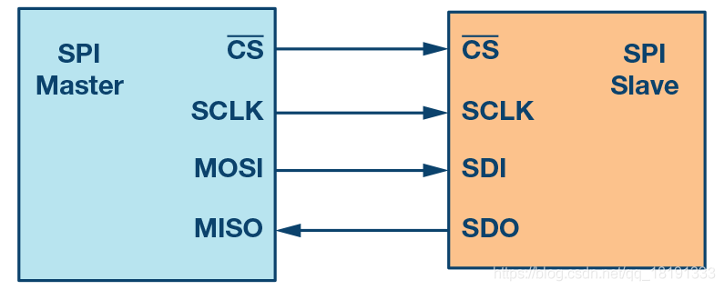

+++
author = "coucou"
title = "单片机——配置相关术语"
date = "2023-08-01"
description = "单片机专题之配置相关术语"
categories = [
    "单片机"
]
tags = [
    "单片机","配置相关术语"
]
+++


# 单片机配置

## 指令周期、机器周期、时钟周期的概念及三者之间的关系

>## 指令周期：
>
>​    CPU每 ***\*取出\**** 一条指令并 **执行** 这条指令，都要完成一系列的操作，这一系列操作所需要的时间通常叫做一个[指令周期](https://baike.baidu.com/item/指令周期)。换言之***\*指令周期是取出一条指令并执行这条指令的时间\****。由于各条指令的操作功能不同，因此***\*各种指令的指令周期是不尽相同的\****。例如一条加法指令的指令周期同一条乘法指令的指令周期是不相同的 。
>
>## 机器周期：
>
>​    **机器周期**也称为***\*CPU周期\****。在计算机中，为了便于管理，常把一条指令的执行过程划分为若干个阶段（如取指、译码、执行等），每一阶段完成一个基本操作。***\*完成一个基本操作所需要的时间称为机器周期\****。一般情况下，一个**机器周期由若干个时钟周期**组成 。
>
>## 时钟周期：
>
>​    **时钟周期**T又称为振荡周期，由单片机片内振荡电路OSC产生，**常定义为时钟脉冲频率的倒数，是时序中最小的时间单位**。例如，若某单片机时钟频率为1MHz，则它的时钟周期T应为1μs。由于时钟脉冲是计算机的基本工作脉冲，它控制着计算机的工作节奏，使计算机的每一步工作都统一到它的步调上来。显然，***\*对同一种机型的计算机，时钟频率越高，计算机的工作速度就越快\****。但是，由于不同的计算机硬件电路和器件的不完全相同，所以它们需要的时钟周期频率范围也不一定相同
>
>
>
>**1 / 1MHz = 1us**
>
>

## 输入输出

> **输入**
>
> 1. 输入上拉：默认输入高电平
> 2. 输入下拉：默认输入低电平
> 3. 浮空输入：不稳定
> 4. 模拟输入：如AD模拟信号
>
> **输出**
>
> 1. 推挽输出：P-MOS和N-MOS均有效，高低电平均有较强驱动能力
> 2. 开漏输出：N-MOS有效，低电平有较强的驱动能力
>
> ​                                                                                 补充：TTL 是斯密特触发器：防止信号不稳定	

## 串口

>1. 波特率
>2. 数据格式：如字长8位
>3. 停止位
>4. 奇偶校验位

## 定时器

>1. 自动重装载值
>2. 定时器分频：配置对应的溢出时间
>3. 计数模式：**向上计数、向下计数** 等等

>###  定时器时间计算
>
>#### 单片机的定时原理
>
>通过每一个机器周期，就加一，通过数1的方式进行计时。
>
>#### 基本概念
>
>1.晶振：又称晶体振荡器，是数字电路“心脏”，是电子元件中不可或缺的频率元件，对于数字电路系统，晶振的好还直接影响系统的稳定性。
>
>2.时钟周期：将晶振的频率的倒数定义为时钟周期，在一个时钟周期内，CPU完成一个基础动作，对于更小的时钟周期，意味着CPU有更好的性能，更高的工作效率。
>
>3.机器周期：将时钟周期的6倍或者12倍定义为一个机器周期，具体的设定需要通过人为进行控制
>
>#### 每一次“加1”经过的时间是多少
>
>当晶振频率是11.0592MHz的时候，等于11059.2KHz = 11059200Hz
>
>机器周期 = 12 x 时钟周期 =12 x (1/时钟频率) 秒 = 12 / 11059200 秒 = 12 000 000 / 11059200 微秒 = 1.085 微秒
>
>也就是说对于11.0592Mhz的晶振，其机器周期就是1.085微秒
>
>#### 实际案例
>
>案例：通过单片机设定一个10ms的定时器有如下的部分
>
>符号	含义
>TL0(Timer Low0)	定时器0的低8位寄存器
>TH0(Timer HIgh0)	定时器0的高8位寄存器
>根据上表，可以知道共16位的寄存器可以数2^16次，就是65536次，而每次计数一下，就会耗费1.085微秒，因此当计数超过65535时，定时器寄存器就会爆表，也就是经过之后就会爆表，通常可以理解为经过71ms之后就会爆表。
>
>对于10ms而要，首先可以计算出10ms定时定时器需要数多少次，设需要数x次，则
>
>设定时器的初始值为y，则
>
>将56320转化成16进制数，通过计算可以知道16#DC00，因此TH = DC ;TL = 00
>
>也就是说需要计数9612次，就可以认为经过了10ms，这时，我们可以用71ms减去10ms的次数，就可以知道定时开始计数的初始值，这个值就是y值
>
>#### 小结
>
>单片机定时器的原理就是通过计算出所定时间需要计数的次数x，通过65536减去x，算出定时器所需的初始值，然后将初始值转化成16进制，填入TH与TL寄存器中，然后通过读取定时器溢出标志位，就可以知道定时器的定时状态。
>
>

## EXIT中断

>1. 中断优先级
>2. 触发方式：**上升沿触发、下降沿触发 ** 等等
>3. 中断线使能
>4. 中断标志位

## PWM输出

**PWM**，是脉冲宽度调制，是控制在一个周期内，控制高电平多长时间，低电平多长时间，在数字电路中IO口就只有两种状态，**0和1(高低)，对应就是0和5V或者0和3.3V）。也就是说，通过调节高低电平时间的变化来调节信号、能量等的变化**

**占空比**是指 ***高电平持续*** **时间** ***比*** 一个 ***周期持续*** 的**时间**。
所以可以通过控制占空比，来控制输出的等效电压。所以对于方波的话，频率和占空比就确定了一个波


>**PWM的频率：**
>
>是指1秒钟内信号从高电平到低电平再回到高电平的次数(一个周期)；也就是说一秒钟PWM有多少个周期, 单位： Hz
>
>表示方式： 50Hz 100Hz
>
>**周期：**
>T=(TIMx_ARR+1)*(TIMx_PSC+1)/TIMxCLK
>其中，TIMxCLK是其时钟频率，若是晶振为8MHz的，一般为72MHz
>
>**占空比：**
>(TIMx_CRRx/TIMx_ARR)*100%


## 输入捕获

输入捕获模式可以用来**测量脉冲宽度或者测量频率**，下图以测量脉宽为例来说明输入捕获的原理


> 假定定时器工作在向上计数模式，图中t1-t2的时间就是我们需要测量的低电平时间。测量方法为：首先设置定时器通道x为下降沿捕获，在t1时刻就会捕获到当前的CNT值，然后立即清零CNT，并设置通道x为上升沿捕获，到t2时刻又会发送捕获事件，得到此时的CNT值（记为CCRx2）。在t1-t2之间可能产生N次定时器溢出，因此需要对定时器溢出做处理，防止低电平太长导致数据不准确。
>
> t1-t2之间计数的次数为：N * ARR + CCRx2，再乘以CNT计数周期即可得到低电平持续时间

## ADC

Analog-to-Digital Converte是指将**连续变量的模拟信号转换为离散的数字信号**

ADC主要有三种输入方式，分别为单端、全差分、伪差分

|    方式    |         引脚接线          | 抗干扰能力 |
| :--------: | :-----------------------: | :--------: |
|  单端输入  |     ADCIN,GND（简单）     |     弱     |
| 全差分输入 | ADCIN+,ADCIN-,GND（复杂） |     强     |
| 伪差分输入 |                           |     中     |

>**分辨率**
>
>分辨率，即每个采样数据精度，用多少位数字来表示采集到一个模拟量，分辨率越高就能采集越精确的数据
>
>常用分辨率：8bit、10bit、12bit
>
>分辨率计算：测量电压范围 / ( 2^位数 - 1 )
>
>示例：测量电压范围0~3.3V，分辨率10bit
>
>​			3.3V / (2^10 - 1) = 3.3V / 1023 = 0.00322V
>
>**转换速率**
>转换速率是指A/D转换一次所需要时间的倒数，即单位时间内完成A/D转换的次数
>
>**采样速率**
>
>采样速率，即每秒对ADC采样的次数
>
>**转换方式**
>
>1. 单次转换模式下，ADC只执行一次转换；
>2. 连续转换模式中，当前面ADC转换一结束马上就启动另一次转换；
>3. 扫描模式用来扫描一组模拟通道
>
>**ADC通道选择**： **规则通道组**和**注入通道组**
>
>在执行规则通道组扫描转换时，如有例外处理则可启用注入通道组的转换。也就是说，注入通道的转换可以打断规则通道的转换，在注入通道被转换完成之后，规则通道才可以继续转换。
>
>**ADC中断**
>
>规则和注入组转换结束时能产生中断，当模拟看门狗状态位被设置时也能产生中断。它们都有独立的中断使能位。 

## I2C

IIC（I2C）是一个**同步半双工串行**通信协议，使用3根线即可连接

| 名称 |  功能  |
| :--: | :----: |
| SCL  | 时钟线 |
| SDA  | 数据线 |
| GND  |  接地  |

> 1. 发送起始信号
> 2. 发送地址
> 3. 接受校验信号
> 4. 发送或接受数据8bit
> 5. 接受校验信号
> 6. 重复
> 7. 发送结束信号
>
> 在空闲状态时（SCL，SDA为高电平），SDA产生下降沿为起始信号
>
> 在SCL为高电平时，SDA产生上升沿信号，之后SCL，SDA全为高，进入空闲状态


## SPI

**SPI**是一种**高速的，全双工，同步**的通信总线



>（1）**MOSI：**主器件数据输出，从器件数据输入
>（2）**MISO：**主器件数据输入，从器件数据输出
>（3）**SCLK ：**时钟信号，由主器件产生
>（4）**CS：**从器件使能信号，由主器件控制


>**采样沿**：SPI采用边沿触发采样、移位发送，CPHA/CPOL组合形成四种SPI时序模式：
>
>1.CPOL = 0低电平为空闲，数据线在时钟为低时可改变，两根数据线在时钟高电平期间须保持稳定，分两种情况：
>   1.1 CPHA=0时，输入侧上升沿采样，输出侧在下降沿移位输出到线上
>   1.2 CPHA=1时，输入侧下降沿采样，输出侧在上升沿移位输出到线上
>
>2.CPOL = 1高电平空闲，两根数据线在时钟为高时可改变，两根数据线在低电平期间须保持稳定。分两种情况：
>   2.1 CPHA=0，输入侧在下降沿采样，输出侧在上升沿移位输出到线上
>   2.2 CPHA=1，输入侧在上升沿采样，输出侧在下降沿移位输出到线上
>
>这里输入输出是相对的。CPOL（clock polarity)控制时钟的极性，CPHA(phase relative to clock)控制相对于时钟的时序相位。CPOL/CPHA排列组合形成四种SPI工作时序模式。
>
>**SPI通讯的优势**
>
>1. 全双工串行通信；
>2. 高速数据传输速率;
>3. 简单的软件配置；
>4. 极其灵活的数据传输，不限于8位，它可以是任意大小的字；
>5. 非常简单的硬件结构。从站不需要唯一地址（与I2C不同）。从机使用主机时钟，不需要精密时钟振荡器/晶振（与UART不同）。不需要收发器（与CAN不同）。
>
>**SPI的缺点**
>
>1. 没有硬件从机应答信号（主机可能在不知情的情况下无处发送）；
>2. 通常仅支持一个主设备；
>3. 需要更多的引脚（与I2C不同）；
>4. 没有定义硬件级别的错误检查协议；
>5. 与RS-232和CAN总线相比，只能支持非常短的距离；

## DMA

direct memory access是一种避开CPU，可以直接对外设和内存进行访问的技术，可以实现外设与内存、内存之间、外设之间数据的访问和搬移。

```c
// DMA结构体, zigbee
typedef struct 
{
  unsigned char SRCADDRH;          // 源地址高字节
  unsigned char SRCADDRL;          // 源地址低字节
  unsigned char DESTADDRH;         // 目标地址高字节
  unsigned char DESTADDRL;         // 目标地址低字节
  unsigned char VLEN      : 3;     // 可变长度传输模式选择
  unsigned char LENH      : 5;     // 传输长度高字节
  unsigned char LENL      : 8;     // 传输长度低字节
  unsigned char WORDSIZE  : 1;     // 字节/字传输
  unsigned char TMODE     : 2;     // 传输模式选择
  unsigned char TRIG      : 5;     // 触发事件选择
  unsigned char SRCINC    : 2;     // 源地址增量
  unsigned char DESTINC   : 2;     // 目标地址增量
  unsigned char IRQMASK   : 1;     // 中断使能
  unsigned char M8        : 1;     // 7/8 bits 字节(只用于字节传输模式)
  unsigned char PRIORITY  : 2;     // 优先级
} DMA_CONFIGURATIONPARAMETERS;
// stm32
typedef struct
{
    uint32_t DMA_PeripheralBaseAddr;  // 设置 DMA 传输的外设基地址
    uint32_t DMA_MemoryBaseAddr;  // 内存基地址
    uint32_t DMA_DIR;  //  设置数据传输方向
    uint32_t DMA_BufferSize;  // 设置一次传输数据量的大小
    uint32_t DMA_PeripheralInc;  // 设置传输数据的时候外设地址是不变还是递增
    uint32_t DMA_MemoryInc;  // 设置传输数据时候内存地址是否递增
    uint32_t DMA_PeripheralDataSize;  //设置外设的的数据长度是为字节传输（8bits），半字传输 (16bits)还是字传输 (32bits)
    uint32_t DMA_MemoryDataSize;  // 设置内存的数据长度
    uint32_t DMA_Mode;  // 设置 DMA 模式是否循环采集
    uint32_t DMA_Priority;  // 设置 DMA 通道的优先级
    uint32_t DMA_M2M;  //设置是否是存储器到存储器模式传输
}DMA_InitTypeDef;
```


​																									
