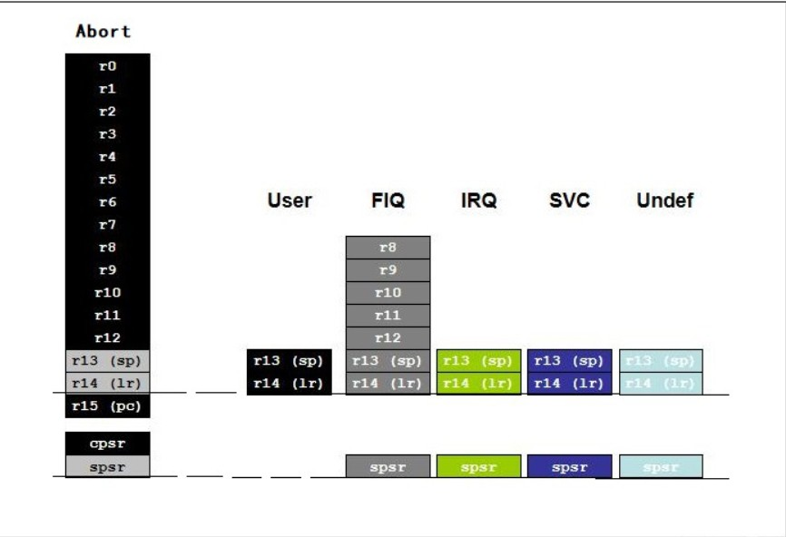

+++
author = "coucou"
title = "单片机——ARM架构"
date = "2023-08-01"
description = "单片机专题之ARM架构"
categories = [
    "单片机"
]
tags = [
    "单片机","ARM架构"
]
+++


## ARM通识

### ARM采用32位架构
>ARM约定一个Byte是8 bits，一个Halfword是16 bits (2 byte)，一个Word是32 bits (4 byte)。
>
>大部分ARM core 提供ARM 指令集（32 bit，每条指令都是4个字节），Thumb 指令集（16bit），Thumb2指令集（16 & 32bit）。

### ARM的7种基本工作模式
>ARM的工作模式分为普通模式、特权模式，其中特权模式又细分为六种模式。诸多模式是为了满足操作系统的安全等级需要，各种模式下可以访问的寄存器不同。
>
>注意:  同一时刻CPU只处于其中一种模式, 程序员可以修改CPSR寄存器，实现各个模式的切换；CPU在某些情况下也会自动切换。
>
>**普通模式（Normal）**
>（1）用户模式（User）：非特权模式，大部分任务执行在这种模式。
>
>**特权模式（Privilege）**
>（2）快速中断模式（FIQ）：当一个高优先级（fast) 中断产生时将会进入这种模式。
>
>（3）普通中断模式（IRQ）：当一个低优先级（normal) 中断产生时将会进入这种模式。
>
>（4）超级用户模式（SVC）：当复位或软中断指令执行时将会进入这种模式。
>
>（5）中止模式（Abort）：当存取异常时将会进入这种模式。
>
>（6）未定义模式（Undef）：当执行未定义指令时会进入这种模式。
>
>（7）系统模式（System）：使用和User模式相同寄存器集的特权模式。
>
>

### ARM的37个通用寄存器

>**（1）通用寄存器**
>通用寄存器是CPU的组成部分，CPU的很多活动都需要通用寄存器的支持和参与。
>
>通用寄存器没有地址，通过寄存器名字来访问。
>
>ARM一共有37个通用寄存器。
>
>**（2）特殊功能寄存器**
>特殊功能寄存器，属于外设硬件的组成部分。使用软件编程控制某一硬件，其实就是编程读写这个硬件的特殊功能寄存器。
>
>注意，特殊功能寄存器有地址，通过地址来访问寄存器。



>**（1）影子式设计**
>注意，上图中除了Abort模式列出所有的寄存器外，其他模式只列出对应位置该模式下特有的寄存器，没有列出的寄存器，则说明和Abort模式共用。比如User模式下有自己的r13和r14寄存器，其他寄存器和Abort模式相同。这样算下来，ARM总共有 37 个寄存器，但**最多只能同时存在18个寄存器**。有些寄存器虽然名字相同，但是在当前模式是不可见的。比如在ARM中有6个名叫r13的寄存器，但在特定处理器模式下，只有一个r13是当前可见的，其他的r13必须切换到对应的模式才能看到。这种设计叫影子寄存器。
>
>这样设计的好处是，当各种异常发生的时候，每种异常模式都可以保存一些重要的数据，异常处理程序完成之后返回异常前的程序时，不会破坏原有的寄存器或状态。
>
>**（2）重要的寄存器**
>这37个寄存器都是32位长度，值得重点理解的寄存器有以下几个。
>
>1. **程序控制寄存器（PC，Program Control Register）**
>
>这个寄存器存放着将要执行的指令的地址，它指向哪里，CPU就会执行哪条指令，所以程序跳转时把目标代码的地址放到PC寄存器中。注意，整个CPU只有一个PC寄存器。
>
>2. **程序状态寄存器（CPSR，Current Program Status Register）**
>
>这个寄存器用来记录CPU的当前状态。注意，整个CPU只有一个CPSR寄存器。
>
>3. **程序状态保存寄存器（SPSR，Saved Program Status Register）**
>
>用来保存CPSR的，子程序返回时将SPSR赋给CPSR。注意，整个CPU有5个SPSR寄存器。
>
>4. **链接寄存器（LR，Link Register）**
>
>这个寄存器的主要作用如下。
>
>一是调用子程序时，用来保存子程序返回地址（子程序返回时返回到哪个地址）。当通过bl或blx指令调用子程序时，硬件会自动将子程序返回地址保存在LR寄存器中。在子程序返回时，把LR的值复制到PC即可实现子程序返回。比如可以使用mov pc,lr完成子程序返回。
>
>二是当异常发生时，LR中保存的值等于异常发生时PC的值减4，因此在各种异常模式下可以根据LR的值返回到异常发生前的相应位置继续执行。

### 程序状态寄存器（CPSR）
>程序状态寄存器（CPSR）在CPU中只有一个，是32bit的，记录着CPU的当前状态。
>
>程序状态寄存器每个bit的含义如下。
>
>**（1）bit31~28是条件位**
>
>N = Negative result from ALU
>Z = Zero result from ALU
>C = ALU operation Carried out
>V = ALU operation oVerflowed
>**（2）bit27是Q位**
>
>仅ARM 5TE/J架构支持，用来指示饱和状态。
>
>**（3）bit24是J位**
>
>仅ARM 5TE/J架构支持，J = 1处理器处于Jazelle状态。
>
>**（4）bit7~6是中断禁止位**
>
>I = 1 表示禁止IRQ。
>F = 1 表示禁止FIQ。
>**（5）bit5是T位**
>
>仅ARM  xT架构支持。
>T = 0 表示处理器处于 ARM 状态。
>T = 1 表示处理器处于 Thumb 状态。
>**（6）bit0~4是Mode位**
>
>这是处理器模式位。
>
>**（7）总结**
>
>CPSR中各个bit位表明了CPU的某些状态信息，这些信息非常重要，和后面学到的汇编指令息息相关（比如BLE指令中的E就和CPSR中的Z标志位有关）。
>
>CPSR中的I、F位和开中断、关中断有关。
>
>CPSR中的mode位（bit4～bit0共5位）决定了CPU的工作模式，在uboot代码中会使用汇编进行设置。

## ARM指令集

### ARM 存储器访问指令
>ARM 处理器是冯诺依曼存储结构，程序空间、RAM 空间及IO 映射空间统一编址，除对对RAM 操作以外，对外围IO、程序数据的访问均要通过加载/存储指令进行。
>
>ARM 的加载/存储指令是可以实现字、半字、无符/有符字节操作；批量加载/存储指令可实现一条指令加载/存储多个寄存器的内容，大大提高效率。

#### LDR 和STR 加载/存储
```assembly
LDR指令用于从内存读取数据放入寄存器中；STR 指令用于将寄存器中的数据保存到内存。指令格式如下：

    LDR{cond}{T} Rd,<地址>;加载指定地址上的数据(字)，放入Rd中

    STR{cond}{T} Rd,<地址>;存储数据(字)到指定地址的存储单元，要存储的数据在Rd中

    LDR{cond}B{T} Rd,<地址>;加载字节数据，放入Rd中，即Rd最低字节有效，高24位清零

    STR{cond}B{T} Rd,<地址>;存储字节数据，要存储的数据在Rd，最低字节有效

其中，T 为可选后缀，若指令有T，那么即使处理器是在特权模式下，存储系统也将访问看成是处理器是在用户模式下。T在用户模式下无效，不能与前索引偏移一起使用T。
```

#### LDM和STM 批量加载/存储指令

```assembly
用于在一组寄存器和一块连续的内存单元之间传输数据。LDM为加载多个寄存器，STM 为存储多个寄存器。允许一条指令传送16 个寄存器的任何子集或所有寄存器。指令格式如下：
    LDM{cond}<模式> Rn{!},reglist{^}

    STM{cond}<模式> Rn{!},reglist{^}

    LDM /STM 的主要用途是现场保护、数据复制、参数传送等。其模式有8种，如下所列：(前面4 种用于数据块的传输，后面4 种是堆栈操作)。

    (1) IA：每次传送后地址加4

    (2) IB：每次传送前地址加4

    (3) DA：每次传送后地址减4

    (4) DB：每次传送前地址减4

    (5) FD：满递减堆栈

    (6) ED：空递减堆栈

    (7) FA：满递增堆栈

    (8) EA：空递增堆栈

    其中，寄存器Rn 为基址寄存器，装有传送数据的初始地址，Rn 不允许为R15;后缀“！”表示最后的地址写回到Rn中;寄存器列表reglist 可包含多于一个寄存器或寄存器范围，使用“,”分开，如{R1,R2,R6-R9},寄存器排列由小到大排列；“＾”后缀不允许在用户模式呈系统模式下使用，若在LDM 指令用寄存器列表中包含有PC 时使用，那么除了正常的多寄存器传送外，将SPSR 拷贝到CPSR 中，这可用于异常处理返回；使用“＾”后缀进行数据传送且寄存器列表不包含PC时，加载/存储的是用户模式的寄存器，而不是当前模式的寄存器。

    地址对准――这些指令忽略地址的位[1：0]。

    批量加载/存储指令举例如下：

    LDMIA R0!,{R3-R9} ;加载R0 指向的地址上的多字数据，保存到R3～R9中，R0 值更新

    STMIA R1!,{R3-R9} ;将R3～R9 的数据存储到R1 指向的地址上，R1值更新

    STMFD SP!,{R0-R7,LR} ;现场保存，将R0～R7、LR入栈

    LDMFD SP!,{R0-R7,PC}^;恢复现场，异常处理返回
```

#### SWP 寄存器和存储器交换指令

```assembly
SWP指令用于将一个内存单元（该单元地址放在寄存器Rn中）的内容读取到一个寄存器Rd中，同时将另一个寄存器Rm 的内容写入到该内存单元中。使用SWP 可实现信号量操作, 指令格式如下：

    SWP{cond}{B} Rd,Rm,[Rn]

    其中，B 为可选后缀，若有B，则交换字节，否则交换32 位字：Rd 为数据从存储器加载到的寄存器;Rm的数据用于存储到存储器中，若Rm 与Rn 相同，则为寄存器与存储器内容进行交换;Rn 为要进行数据交换的存储器地址，Rn 不能与Rd 和Rm 相同。

    SWP 指令举例如下：

    SWP R1,R1,[R0] ; 将R1 的内容与R0 指向的存储单元的内容进行交换

    SWP R1,R2,,[R0] ; 将R0 指向的存储单元内容读取一字节数据到R1中(高24 位清零),并将R2 的内容写入到该内存单元中(最低字节有效)
```

### ARM 数据处理指令
>  数据处理指令大致可分为3 类：
>
>（1）数据传送指令（如MOV、MVN）
>
>（2）算术逻辑运算指令（如ADD,SUM,AND）
>
>（3）比较指令（如CMP、TST）。
>
>数据处理指令只能对寄存器的内容操作。
>
>所有ARM 数据处理指令均可选择使用S 后缀，以影响状态标志。比较指令CMP、CMN、TST和TEQ不需要后缀S，它们会直接影响状态标志。

#### MOV 数据传送指令

```assembly
将立即数或寄存器(operant2)传送到目标寄存器Rd，可用于移位运算等操作。指令格式如下：
    MOV{cond}{S} Rd,operand2

    MOV 指令举例如下：

    MOV R1#0x10 ;R1=0x10

    MOV R0,R1 ;R0=R1

    MOVS R3,R1,LSL #2 ;R3=R1＜＜2，并影响标志位

    MOV PC,LR   ;PC=LR ，子程序返回
```

#### MVN 数据非传送指令

```assembly
将立即数或寄存器(operand2)按位取反后传送到目标寄存器(Rd)。指令格式如下：
    MVN{cond}{S} Rd,operand2

    MVN 指令举例如下：

    MVN R1,#0xFF ;R1=0xFFFFFF00

    MVN R1,R2 ;将R2 取反，结果存到R1
```

#### 加减运算指令   

```assembly
1.  ADD 加法运算指令
将operand2 数据与Rn 的值相加，结果保存到Rd 寄存器。格式如下：
    ADD{cond}{S} Rd,Rn,operand2

    ADD 指令举例如下：

    ADDS R1,R1,#1 ;R1=R1+1

    ADD R1,R1,R2 ;R1=R1+R2

    ADDS R3,R1,R2,LSL #2 ;R3=R1+R2＜＜2
    
2. SUB 减法运算指令
用寄存器Rn 减去operand2，结果保存到Rd 中，格式如下：
    SUB{cond}{S} Rd,Rn,operand2

    SUB 指令举例如下：

    SUBS R0,R0,#1 ;R0=R0-1

    SUBS R2,R1,R2 ;R2=R1-R2

    SUB R6,R7,#0x10 ;R6=R7-0x10
    
3. RSB 逆向减法指令
用寄存器operand2 减法Rn，结果保存到Rd 中，格式如下：
    RSB{cond}{S} Rd,Rn,operand2

    SUB 指令举例如下：

    RSB R3,R1,#0xFF00 ;R3=0xFF00-R1

    RSBS R1,R2,R2,LSL #2 ;R1=R2＜＜2-R2=R2×3

    RSB R0,R1,#0 ;R0=-R1
    
4. ADC 带进位加法指令
将operand2 的数据与Rn 的值相加，再加上CPSR中的C 条件标志位。结果保存到Rd 寄存器。指令格式如下：
    ADC{cond}{S} Rd,Rn,operand2

    ADC 指令举例如下：

    ADDS R0,R0,R2

    ADC R1,R1,R3 ;使用ADC 实现64 位加法，(R1、R0)=(R1、R0)+（R3、R2）
    
5. SBC 带进位减法指令
用寄存器Rn 减去operand2，再减去CPSR 中的C条件标志位的非（即若C 标志清零，则结果减去1），结果保存到Rd 中。指令格式如下：
    SCB{cond}{S}Rd,Rn,operand2

    SBC 指令举例如下：

    SUBS R0，R0，R2

    SBC R1，R1，R3 ;使用SBC 实现64 位减法，(R1,R0)-(R3,R2)
    
6. RSC 带进位逆向减法指令
用寄存器operand2 减去Rn，再减去CPSR 中的C条件标志位，结果保存到Rd 中。指令格式如下：
    RSC{cond}{S} Rd,Rn,operand2

    RSC 指令举例如下：

    RSBS R2,R0,#0

    RSC R3,R1,#0 ;使用RSC 指令实现求64 位数值的负数
```

#### 逻辑操作指令
```assembly
1. AND 逻辑与指令
将operand2 值与寄存器Rn 的值按位作逻辑与操作，结果保存到Rd中。指令格式如下：
    AND{cond}{S} Rd,Rn,operand2

    AND 指令举例如下：

    ANDS R0,R0,#x01 ;R0=R0&0x01，取出最低位数据

    AND R2,R1,R3 ;R2=R1&R3
    
2. ORR 逻辑或指令
将operand2 的值与寄存器Rn的值按位作逻辑或操作，结果保存到Rd 中。指令格式如下：
    ORR{cond}{S} Rd,Rn,operand2

    ORR 指令举例如下：

    ORR R0,R0,#x0F ;将R0 的低4 位置1

    MOV R1,R2,LSR #4

    ORR R3,R1,R3,LSL #8 ;使用ORR 指令将近R2 的高8位数据移入到R3 低8 位中
    
3. EOR 逻辑异或操作指令
将operand2 的值与寄存器Rn 的值按位作逻辑异或操作，结果保存到Rd中。指令格式如下：
    EOR{cond}{S}Rd,Rn,operand2

    EOR 指令举例如下：

    EOR R1,R1,#0x0F ;将R1 的低4 位取反

    EOR R2,R1,R0 ;R2=R1^R0

    EORS R0,R5,#0x01 ;将R5 和0x01 进行逻辑异或，结果保存到R0，并影响标志位
    
4. BIC 位清除指令
将寄存器Rn 的值与operand2 的值的反码按位作逻辑与操作，结果保存到Rd中。指令格式如下：
    BIC{cond}{S}Rd,Rn,operand2

    BIC 指令举例如下：

    BIC R1,R1,#0x0F ;将R1 的低4 位清零，其它位不变

    BIC R1,R2,R3 ;将拭的反码和R2 相逻辑与，结果保存到R1
```

#### 比较指令
```assembly
 1. CMP 比较指令,指令使用寄存器Rn 的值减去operand2 的值，根据操作的结果更新CPSR中的相应条件标志位，以便后面的指令根据相应的条件标志来判断是否执行。指令格式如下：
    CMP{cond} Rn,operand2

    CMP 指令举例如下：

    CMP R1,#10 ;R1 与10 比较，设置相关标志位

    CMP R1,R2 ;R1 与R2 比较，设置相关标志位

    CMP 指令与SUBS 指令的区别在于CMP 指令不保存运算结果。在进行两个数据大小判断时，常用CMP指令及相应的条件码来操作。
    
 2. CMN 负数比较指令,指令使用寄存器Rn 与值加上operand2 的值，根据操作的结果更新CPSR中的相应条件标志位，以便后面的指令根据相应的条件标志来判断是否执行，指令格式如下：
    CMN{cond} Rn,operand2

    CMN R0,#1 ;R0+1,判断R0 是否为1 的补码，若是Z 置位

    CMN 指令与ADDS 指令的区别在于CMN 指令不保存运算结果。CMN指令可用于负数比较，比如CMNR0，#1 指令则表示R0 与-1 比较，若R0 为-(即1 的补码)，则Z 置位，否则Z复位。
    
 
```

#### 乘法指令
> ARM7TDMI(-S)具有32×32 乘法指令、32×32 乘加指令、32×32结果为64 位的乘法指令。

```assembly
1. MUL 32 位乘法指令, 指令将Rm 和Rs 中的值相乘，结果的低32 位保存到Rd中。指令格式如下：
    MUL{cond}{S} Rd,Rm,Rs

    MUL 指令举例如下：

    MUL R1,R2,R3 ;R1=R2×R3

    MULS R0,R3,R7 ;R0=R3×R7，同时设置CPSR 中的N位和Z 位
    
2. MLA 32 位乘加指令, 指令将Rm 和Rs 中的值相乘，再将乘积加上第3 个操作数，结果的低32位保存到Rd 中。指令格式如下：
    MLA{cond}{S} Rd,Rm,Rs,Rn

    MLA 指令举例如下：

    MLA R1,R2,R3,R0 ;R1=R2×R3+10
```

### ARM 跳转指令
>两种方式可以实现程序的跳转：
>
>（1）使用跳转指令直接跳转，跳转指令有跳转指令B，带链接的跳转指令BL ，带状态切换的跳转指令BX。
>
>（2）直接向PC 寄存器赋值实现跳转。

```assembly
1. B 跳转指令, 跳转到指定的地址执行程序。

   B{cond} label

   举例如下：
   B WAITA ;跳转到WAITA 标号处

   B 0x1234 ;跳转到绝对地址0x1234 处

  跳转到指令B 限制在当前指令的±32Mb 的范围内。
  
2. BL 带链接的跳转指令, 指令将下一条指令的地址拷贝到R14(即LR)链接寄存器中，然后跳转到指定地址运行程序。
   BL{cond} label

   举例如下：

   BL DELAY

   跳转指令B 限制在当前指令的±32MB 的范围内。BL 指令用于子程序调用。
   
3. BX 带状态切换的跳转指令, 跳转到Rm 指定的地址执行程序，若Rm 的位[0]为1，则跳转时自动将CPSR 中的标志T 置位，即把目标地址的代码解释为Thumb代码;若Rm 的位[0]为0，则跳转时自动将CPSR 中的标志T 复位，即把目标地址的代码解释为ARM代码。指令格式如下：
   BX{cond} Rm

   举例如下：

   ADRL R0,ThumbFun+1

   BX R0 ;跳转到R0 指定的地址，并根据R0 的最低位来切换处理器状态
   
4. BLX, BLX目标地址：跳转，改变状态及保存PC值
```

### ARM 协处理器指令

> ARM 支持协处理器操作，协处理器的控制要通过协处理器命令实现。

```assembly
1. CDP 协处理器数据操作指令
ARM 处理器通过CDP 指令通知ARM 协处理器执行特定的操作。该操作由协处理器完成，即对命令的参数的解释与协处理器有关，指令的使用取决于协处理器。若协处理器不能成功地执行该操作，将产生未定义指令异常中断。指令格式如下：
    CDP{cond}coproc,opcodel,CRd,CRn,CRm{,opcode2}

    其中： coproc 指令操作的协处理器名。标准名为pn,n 为0～15。

    opcodel 协处理器的特定操作码。

    CRd 作为目标寄存器的协处理器寄存器。

    CRN 存放第1 个操作数的协处理器寄存器。

    CRm 存放第2 个操作数的协处理器寄存器。

    Opcode2 可选的协处理器特定操作码。

    CDP 指令举例如下：

    CDP p7,0,c0,c2,c3,0 ;协处理器7 操作，操作码为0，可选操作码为0

    CDP p6,1,c3,c4,c5 ;协处理器操作，操作码为1

2. LDC 协处理器数据读取指令
LDC指令从某一连续的内存单元将数据读取到协处理器的寄存器中。协处理器数据的数据的传送，由协处理器来控传送的字数。若协处理器不能成功地执行该操作，将产生未定义指令异常中断。指令格式如下：
    LDC{cond}{L} coproc,CRd,<地址>

    其中： L 可选后缀，指明是长整数传送。

    coproc 指令操作的协处理器名。标准名为pn，n 为0～15

    CRd 作为目标寄存的协处理器寄存器。

    <地址> 指定的内存地址

    LDC 指令举例如下：

    LDC p5,c2,[R2,#4];读取R2+4指向的内存单元的数据，传送到协处理器p5的c2寄存器中

    LDC p6,c2,[R1] ;读取是指向的内存单元的数据，传送到协处理器p6的c2 寄存器中
    
3. STC 协处理器数据写入指令
STC指令将协处理器的寄存器数据写入到某一连续的内存单元中。进行协处理器数据的数据传送，由协处理器来控制传送的字数。若协处理器不能成功地执行该操作，将产生未定义指令异常中断。指令格式如下：
    STC{cond}{L} coproc,CRd,<地址>

    其中： L 可选后缀，指明是长整数传送。

    coproc 指令操作的协处理器名。标准名为pn，n 为0～15

    CRd 作为目标寄存的协处理器寄存器。

    <地址> 指定的内存地址

    STC 指令举例如下：

    STC p5,c1,[R0]

    STC p5,c1,[Ro,#-0x04]
    
4. MCR  ARM寄存器到协处理器寄存器的数据传送指令
MCR 指令将ARM 处理器的寄存器中的数据传送到协处理器的寄存器中。若协处理器不能成功地执行该操作，将产生未定义指令异常中断。指令格式如下：
    MCR{cond}coproc,opcodel,Rd,CRn,CRm{,opcode2}

    其中：coproc 指令操作的协处理器名。标准名为pn，n 为0～15。

    cpcodel 协处理器的特定操作码。

    RD 作为目标寄存器。

    CRn 存放第1 个操作数的协处理器寄存器

    CRm 存放第2 个操作数的协处理器寄存器。

    Opcode2 可选的协处理器特定操作码。

    MCR 指令举例如下：

    MCR p6,2,R7,c1,c2,

    MCR P7,0,R1,c3,c2,1,
    
5. MRC 协处理器寄存器到ARM寄存器到的数据传送指令
MRC 指令将协处理器寄存器中的数据传送到ARM 处理器的寄存器中。若协处理器不能成功地执行该操作。将产生未定义异常中断。指令格式如下：
    MRC {cond}coproc,opcodel,Rd,CRn,CRm{,opcode2}

    其中：coproc 指令操作的协处理器名。标准名为pn，n为0～15。

    opcodel 协处理器的特定操作码。

    Rd 作为目标寄存器。

    CRn 存放第1 个操作数的协处理器寄存器。

    CRm 存放第2 个操作数的协处理器寄存器。

    opcode2 可选的协处理器特定操作码。

    MRC 指令举例如下：

    MRC p5,2,R2,c3,c2

    MRC p7,0,R0,c1,c2,1
```

### ARM 杂项指令
```assembly
1. SWI 软中断指令, SWI 指令用于产生软中断，从而实现在用户模式变换到管理模式，CPSR保存到管理模式的SPSR中，执行转移到SWI 向量，在其它模式下也可使用SWI 指令，处理同样地切换到管理模式。指令格式如下：

    SWI{cond} immed_24

    其中：immed_24 24 位立即数，值为0～16777215 之间的整数。

    SWI 指令举例如下：

    SWI 0 ;软中断，中断立即数为0

    SWI 0x123456 ;软中断，中断立即数为0x123456
    
2. MRS 读状态寄存器指令, 在ARM 处理器中，只有MRS 指令可以状态寄存器CPSR或SPSR读出到通用寄存器中。指令格式如下：
	MRS{cond} Rd ,psr

    其中： Rd 目标寄存器。Rd 不允许为R15。

    psr CPSR 或SPSR

    MRS指令举例如下：

    MRS R1,CPSR     ;将CPSR状态寄存器读取，保存到R1 中

    MRS R2,SPSR     ;将SPSR状态寄存器读取，保存到R2 中

3. MSR 写状态寄存器指令, 在ARM 处理器中。只有MSR 指令可以直接设置状态寄存器CPSR或SPSR。指令格式如下：
    MSR{cond} psr_fields,#immed_8r

    MSR{cond} psr_fields,Rm

    其中： psr CPSR 或SPSR

    fields 指定传送的区域。Fields 可以是以下的一种或多种(字母必须为小写)：

    c 控制域屏蔽字节(psr[7…0])

    x 扩展域屏蔽字节(psr[15…8])

    s 状态域屏蔽字节(psr[23。…16])

    f 标志域屏蔽字节(psr[31…24])

    immed_8r 要传送到状态寄存器指定域的立即数，8 位。

    Rm 要传送到状态寄存器指定域的数据的源寄存器。

    MSR 指令举例如下：

    MSR CPSR_c,#0xD3 ;CPSR[7…0]=0xD3，即切换到管理模式。

    MSR CPSR_cxsf,R3 ;CPSR=R3
```

### ARM 伪指令
   >ARM 伪指令不是ARM 指令集中的指令，只是为了编程方便编译器定义了伪指令，使用时可以像其它ARM 指令一样使用，但在编译时这些指令将被等效的ARM 指令代替。
   >
   >ARM伪指令有四条，分别为ADR 伪指令、ADRL 伪指令、LDR 伪指令和NOP 伪指令。

```assembly
1. ADR 小范围的地址读取伪指令
ADR 指令将基于PC 相对偏移的地址值读取到寄存器中。在汇编编译源程序时，ADR伪指令被编译器替换成一条合适的指令。通常，编译器用一条ADD 指令或SUB 指令来实现该ADR 伪指令的功能，若不能用一条指令实现，则产生错误，编译失败。
    ADR 伪指令格式如下：

    ADR{cond} register,exper

    其中：register 加载的目标寄存器。

    exper 地址表达式。当地址值是非字地齐时，取值范围-255～255 字节之间；当地址是字对齐时，取值范围-1020～1020字节之间。

    对于基于PC 相对偏移的地址值时，给定范围是相对当前指令地址后两个字处(因为ARM7TDMI为三级流水线)。

    ADR 伪指令举例如下：

    LOOP MOV R1, #0xF0

    …

    ADR R2, LOOP        ;将LOOP 的地址放入R2

    ADR R3, LOOP+4
    
2. NOP 空操作伪指令
NOP 伪指令在汇编时将会被代替成ARM 中的空操作，比如可能为“MOV R0, R0”指令等，NOP 伪指令格式如下：
    NOP

    NOP
```
