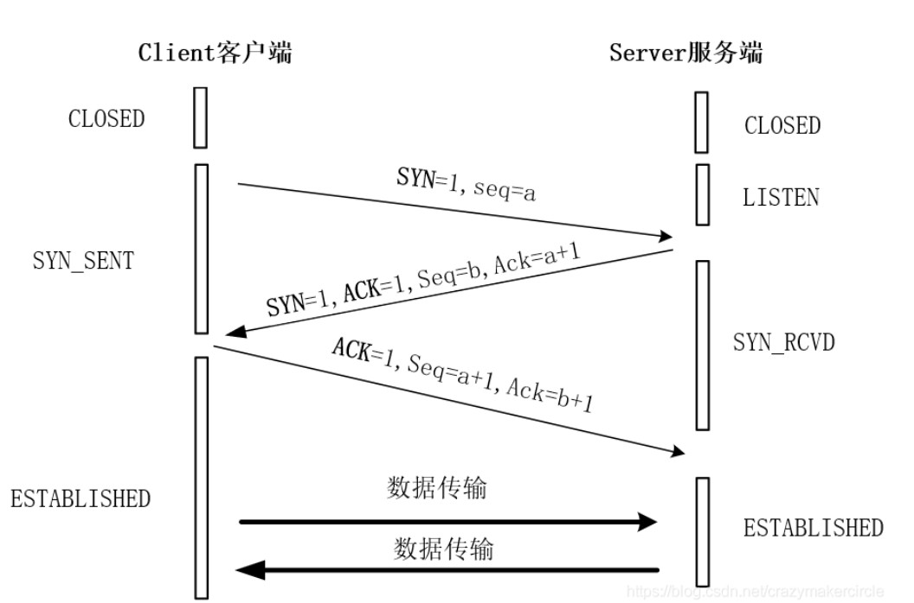

+++
author = "coucou"
title = "网络协议——常见协议"
date = "2023-08-01"
description = "网络协议专题之常见协议"
categories = [
    "网络协议"
]
tags = [
    "网络协议","常见协议"
]
+++


# 网络协议

## TCP/UDP

| 类型 | 特点                       | 性能                   | 应用过场景       | 首部字节 |
| ---- | -------------------------- | ---------------------- | ---------------- | -------- |
| TCP  | 面向连接、可靠、字节流     | 传输效率慢、所需资源多 | 文件、邮件传输   | 20-60    |
| UDP  | 无连接、不可靠、数据报文段 | 传输效率快、所需资源少 | 语音、视频、直播 | 8个字节  |

### TCP三次握手和四次挥手



>**原因为了防止建立重复的连接而损耗资源或造成其他问题**
>
>**第一次握手**
>第一次握手由客户端向服务器 发出：客户端发送一个TCP数据报，其中，TCP分组的源端口为客户端发起通信建立的进程端口，而目的端口为服务器处理请求的进程端口号，比如80端口。在表示建立连接的TCP分组中，SYN标志位为被置1，则告知服务器发送该分组的目的是请求建立连接，并且当SYN置1时，该分组中的seq字段发送的是初始序列号cilent_isn，初始序列号的取值方案有多种，一般取随机值。
>
>**第二次握手**
>第二次握手由服务器向客户端发出：服务器在成功接收了客户端第一次握手发送的分组后，首先需要解析收到的TCP分组，发现SYN置1后，得知这个客户端发送分组的目的是为了建立连接，在确认完毕分组信息后，服务器也会向客户端发送一个TCP分组来代表第二次握手。
>
>这个由服务器发送的TCP分组包含以下内容：
>
>首先将代表建立连接目的的SYN标志位同样置1
>然后随机地产生服务器端的初始序列号 server_isn在seq字段中发送
>同时将代表累计确认接收字节位数的ACK确认号发送，该确认号ACK的值为客户端发送的TCP分组中的初始序列号+1,即cilent_isn+1。也就是发送服务器期望接收的下一个字节序号。
>**第三次握手**
>第三次握手由客户端向服务器发出：客户端在接收到服务器第二次握手的回复之后，同样会接收来自于服务器的TCP分组并进行解读：由SYN为1解读该TCP分组的目的是继续建立连接，由分组中的ACK确认号了解到服务器已经成功接收了前cilent_isn个字节的内容，并期望接收第cilent_isn+1个字节的字节序号，同时累计确认来自服务器的初始序列号。并发送最后一个TCP分组给服务器来完成第三次握手。
>
>**第一次挥手：** 客户端因为不再有数据发送给服务器，所以向服务器发送FIN报文表示想要关闭连接，不会再发送数据了。同时包含客户端的报文序号M
>
>**第二次挥手：** 服务器在接收了来自客户端的FIN报文后，得知客户端不再发送数据，将要关闭连接。但是，此时服务器端获取还有部分数据没有回传给客户端，服务器可能还要向客户端发送一部分数据才能关闭连接。所以服务器不会立马同意关闭连接，而是先发送表示确认信息的ACK报文，该ACK报文中包含了值为M+1的确认号。
>
>**第三次挥手：** 在服务器端完成向客户端传送最后的数据后，此时不再有数据需要传输了。那么服务器也准备关闭连接，所以向客户端发送表示关闭连接的FIN报文，报文中包含了服务器端的序号N
>
>**第四次挥手：** 在客户端也收到了服务器端发送的FIN报文之后，得知服务器端也可以关闭连接了，此时再向服务器发送最后一次确认报文ACK，使连接成功关闭，ACK报文中的确认号为N+1

### UDP

>**格式**
>
>
>
>- 源端口号：表示数据从哪里发送
>- 目的端口号：表示数据要发送到哪里区
>- 16位UDP长度：表示整个数据报（UDP首部+UDP数据）的最大长度
>- 16位UDP校验和：检测数据是否被破坏，如果UDP报文校验和检测出错，就会直接丢弃 
>
>**特点**
>
>1. 无连接 
>2. 不可靠
>3. 面向数据报 

## HTTP

>**HTTP (全称为 “超文本传输协议”) 是一种应用非常广泛的应用层协议。**

### tcp协议与http协议

>从应用领域来说，tcp协议主要用以数据传输控制，而http协议主要用于应用层面的数据交互，本质上两者没有可比性。
>http协议属于应用层协议，是建立在tcp协议的基础上的，http协议以客户端请求和服务端应答为标准，浏览器通常为客户端，而web服务器称之为服务端；客户端打开任意一个端口向服务端的指定端口发起http请求，首先是发起tcp三次握手，tcp三次握手的目的是建立可靠的数据连接通道，tcp三次握手建立完毕，进行http数据交互，如下图：
>

### http原理


>客户端浏览器向服务器发起请求request，服务器收到request后进行处理，会产生响应的response信息返回给浏览器，客户端浏览器收到服务器返回的response信息，会对信息进行解析处理，最终用户看到浏览器展示web服务器的网页内容，客户端发起请求request，服务器响应response；
>
>request消息分为3个部分：request line ，request header、空行、body；
>response消息分为3个部分： response line ，response header，空行、body；
>
>request line，包含三部分：请求方法GET方法、请求 URI、http 协议版本；
>request header一般包括服务器主机ip，User-Agent表示用户使用的代理软件，一般是指浏览器；
>空行用来表示请求头结束了；
>body，报文主体，可以添加任意的其他数据，注意：get方法的body默认为空，post方法的body才有数据；
>
>response line ，响应行，包含了协议版本，状态码和状态信息，200就是状态码，ok就是状态消息；
>response header，响应头，包含响应时间，服务主机类型等附加信息；
>空行用来表示响应头结束了；
>响应的报文主体body就是返回给客户端的网页数据；
>
>下面我们来使用curl命令来看一下request消息和response信息：

```html
curl -v http://192.168.43.226/index.html		#先启动nginx，再写这条命令执行
*   Trying 192.168.43.226...
* tcp_NODELAY set
* Connected to 192.168.43.226 (192.168.43.226) port 80 (#0)
> GET /index.html http/1.1				#这一行就是请求行request line，包含三部分：请求方法GET方法、请求 URI、http 协议版本
> Host: 192.168.43.226				    #请求头request header，请求头包括服务器主机IP，User-Agent表示用户使用的代理软件，一般是
> User-Agent: curl/7.61.1				# 指浏览器
> Accept: */*
>										#这一行空行通过回车符换行符告诉web服务器请求头结束
>										#这里是body消息，但因为GET方法的body默认为空，所以这里没有显示
< http/1.1 200 OK						#response line ，响应行，包含了协议版本，状态码和状态信息，200就是状态码，ok就是状态消息
< Server: nginx/1.18.0					#response header，响应头，包含响应时间，服务主机类型等附加信息
< Date: Wed, 19 May 2021 02:27:09 GMT
< Content-Type: text/html
< Content-Length: 724
< Last-Modified: Sun, 09 May 2021 08:11:51 GMT
< Connection: keep-alive
< ETag: "60979947-2d4"
< Accept-Ranges: bytes
<										#空行，表示response header结束
<!DOCTYPE html>							#下面就是响应的报文主体body
<html>
<head>
<title>Welcome to nginx!</title>
<style>
    body {
        width: 35em;
        margin: 0 auto;
        font-family: Tahoma, Verdana, Arial, sans-serif;
    }
</style>
</head>
<body>
<h1>Welcome to nginx!</h1>
<p>     1.go for it! just do it!</p>
<p>     2.better late than never.</p>
<p>     3.Don't give up and don't give in. </p>
<p>     4.one today is worth two tomorrows.</p>
<p>     5.a bold attempt is half success.</p>
<p>                             --from web01_port80 server </p>

<p>For online documentation and support please refer to
<a href="http://nginx.org/">nginx.org</a>.<br/>
Commercial support is available at
<a href="http://nginx.com/">nginx.com</a>.</p>

<p><em>Thank you for using nginx.</em></p>
</body>
</html>

```


>1、用户在浏览器输入访问地址：https://www.baidu.com
>2、浏览器请求DNS进行域名解析，从而得到域名对应的IP地址
>3、浏览器将端口号（默认80）从访问地址中解析出来
>4、浏览器通过解析出来的IP和端口号与服务器之间进行tcp 3次握手建立一条可靠的tcp连接
>5、3次握手建立好tcp连接后，浏览器向服务器发送一条http请求报文
>6、服务器响应并读取浏览器的请求信息，然后返回响应报文
>7、服务器关闭http连接，关闭tcp连接，浏览器显示访问内容到网页上
>
>**统一资源定位符URL**
>
>URL由三部分组成：资源类型、存放资源的主机域名、资源文件名
>也可认为由4部分组成：协议、主机、端口、路径
>URL的一般语法格式为：protocol :// hostname[:port] / path / [;parameters][?query-string]#fragment
>
>**protocol（协议）：**指定使用的传输协议，下表列出 protocol 属性的有效方案名称。 最常用的是http协议，它也是WWW中应用最广的协议，还有ftp协议等，ftp 通过 ftp访问资源，格式 ftp://；
>**hostname（主机名）：**是指存放资源的服务器的域名系统(DNS) 主机名或 IP 地址，有时，在主机名前也可以包含连接到服务器所需的用户名和密码（格式：username:password@hostname）；
>**port（端口号）：**整数，可选，省略时使用服务的默认端口，各种传输协议都有默认的端口号，如http的默认端口为80；
>**path（路径）：**由零或多个“/”符号隔开的字符串，一般用来表示主机上的一个目录或文件地址；
>**parameters（参数）：**这是用于指定特殊参数的可选项；
>**query(查询)：**可选，用于给动态网页（如使用CGI、ISAPI、PHP/JSP/ASP/ASP.NET等技术制作的网页）传递参数，可有多个参数，用“&”符号隔开，每个参数的名和值用“=”符号隔开；
>**fragment（信息片断）：**字符串，用于指定网络资源中的片断；例如一个网页中有多个名词解释，可使用fragment直接定位到某一名词解释；
>
>## http请求方法(最常用)
>
>1. GET : 客户端请求指定资源信息，服务器返回指定资源     注意：get方法是没有请求报文主体的，post方法才有 
>
>2. POST : 将客户端的数据提交到服务器，例如：注册表单

## HTTP & SOCKET

### 概述

>应用层：HTTP协议，主要解决如何包装数据；
>
>传输层： TCP协议、TPC/IP协议；
>
>网络层： IP 协议
>
>socket则是对TCP/IP协议的封装和应用，Socket本身并不是协议而是一个调用接口，通过Socket才能使用TCP/IP协议。实际上，Socket跟TCP/IP协议没有必然的联系。 Socket的出现只是使得程序员更方便地使用TCP/IP协议栈而已，从而形成了最基本的函数接口，比如create、 listen、connect、accept、send、read和write等等。
>
>关于TCP /IP和HTTP协议的关系，网络有一段比较容易理解的介绍： “我们在传输数据时，可以只使用（传输层）TCP/IP协议，但是那样的话，如果没有应用层，便无法识别数据内容，如果想要使传输的数据有意义，则必须使用到应用层协议，应用层协议有很多，比如HTTP、FTP、TELNET等，也可以自己定义应用层协议。WEB使用HTTP协议作应用层协议，以封装 HTTP 文本信息，然后使用TCP/IP做传输层协议将它发到网络上。”

### TCP连接

>建立一个TCP连接需要经过“三次握手”，具体如下：
>第一次握手：客户端发送请求包到服务器，等待服务器确认
>第二次握手：服务器响应客户端请求，同时也发送一个回应包给客户端
>第三次握手：客户端收到服务器的回应包后，向服务器发送确认包
>
>握手过程中传送的包里，不包含数据，三次握手完毕后，客户端与服务端才正式的开始传递数据。
>TCP一旦连接起来，在客户端和服务端任何一方主动关闭连接之前，TCP连接都将被一直保持下去。
>断开连接时，服务器和客户端都可以主动发起断开TCP连接的请求，断开过程需要经过“四次握手”
>
>握手过程中传送的包里不包含数据，三次握手完毕后，客户端与服务器才正式开始传送数据。理想状态下，TCP连接一旦建立，在通信双方中的任何一方主动关闭连接之前，TCP 连接都将被一直保持下去。断开连接时服务器和客户端均可以主动发起断开TCP连接的请求，断开过程需要经过“四次挥手”。

### HTTP连接

>HTTP协议即**超文本传送协议**(Hypertext Transfer Protocol )，是Web联网的基础，也是手机联网常用的协议之一，HTTP协议是建立在TCP协议之上的一种应用。
>
>HTTP连接最显著的特点是客户端发送的每次请求都需要服务器回送响应，在请求结束后，会主动释放连接。从建立连接到关闭连接的过程称为“一次连接”。
>
>1）在HTTP 1.0中，客户端的每次请求都要求建立一次单独的连接，在处理完本次请求后，就自动释放连接。
>
>2）在HTTP 1.1中则可以在一次连接中处理多个请求，并且多个请求可以重叠进行，不需要等待一个请求结束后再发送下一个请求。
>
>由于HTTP在每次请求结束后都会主动释放连接，因此HTTP连接是一种**“短连接”**，要保持客户端程序的在线状态，需要不断地向服务器发起连接请求。通常的做法是即时不需要获得任何数据，客户端也保持每隔一段固定的时间向服务器发送一次“保持连接”的请求，服务器在收到该请求后对客户端进行回复，表明知道客户端“在线”。若服务器长时间无法收到客户端的请求，则认为客户端“下线”，若客户端长时间无法收到服务器的回复，则认为网络已经断开。

### SOCKET原理

>**套接字（socket）概念**
>Socket是通信的基石，是支持TCP/IP协议的网络通信的基本操作单元。它是网络通信过程中端点的抽象表示，包含进行网络通信必须的五种信息：连接使用的协议，本地主机的IP地址，本地进程的协议端口，远地主机的IP地址，远地进程的协议端口。
>应用层通过传输层进行数据通信时，TCP会遇到同时为多个应用程序进程提供并发服务的问题。多个TCP连接或多个应用程序进程可能需要通过同一个 TCP协议端口传输数据。为了区别不同的应用程序进程和连接，许多计算机操作系统为应用程序与TCP／IP协议交互提供了套接字(Socket)接口。应用层可以和传输层通过Socket接口，区分来自不同应用程序进程或网络连接的通信，实现数据传输的并发服务。
>**建立socket连接**
>建立Socket连接至少需要一对套接字，其中一个运行于客户端，称为ClientSocket ，另一个运行于服务器端，称为ServerSocket 
>
>套接字之间的连接过程分为三个步骤：服务器监听，客户端请求，连接确认。
>
>**服务器监听：**服务器端套接字并不定位具体的客户端套接字，而是处于等待连接的状态，实时监控网络状态，等待客户端的连接请求。
>
>**客户端请求：**指客户端的套接字提出连接请求，要连接的目标是服务器端的套接字。为此，客户端的套接字必须首先描述它要连接的服务器的套接字，指出服务器端套接字的地址和端口号，然后就向服务器端套接字提出连接请求。
>
>**连接确认：**当服务器端套接字监听到或接收到客户端套接字的连接请求时，就响应客户端套接字的请求，建立一个新的线程，把服务器端套接字的描述发给客户端，一旦客户端确认此描述，双方就正式建立连接。而服务器端套接字继续处于监听状态，继续接收其他客户端套接字的连接请求。
>
>

## MQTT

### 概述

>MQTT（Message Queuing Telemetry Transport，消息队列遥测传输协议），是一种基于`发布/订阅`（`publish/subscribe`）模式的“轻量级”通讯协议，该协议构建于**TCP/IP协议**上
>
>MQTT最大优点在于，**用极少的代码和有限的带宽，为连接远程设备提供实时可靠的消息服务**。作为一种低开销、低带宽占用的即时通讯协议，使其在物联网、小型设备、移动应用等方面有较广泛的应用。


### 消息格式

>**消息格式如下**
>
>固定报头|可变报头|负载(消息体)
>
>1. 固定报头
>
>
>
>
>
>
>
>**byte2:剩余长度**( Remaining Length)表示当前报文剩余部分的字节数，包括可变报头和负载的数据。剩余长度不包括用于编码剩余长度字段本身的字节数。共1~4个字节，每个字节的低7位用于编码数据，最高位表示是否有更多字节。最大允许发送256M控制报文(0xff,0xff,0xff,0x7f)=256M;
>
>2. 可变报头
>3. 负载（有效消息）

### QoS等级

>**level 0：最多一次的传输**
>
>消息是基于TCP/IP网络传输的。没有回应，在协议中也没有定义重传的语义。消息可能到达服务器1次，也可能根本不会到达。
>
>**level 1：至少一次的传输**
>
>服务器接收到消息会被确认，通过传输一个PUBACK信息。如果有一个可以辨认的传输失败，无论是通讯连接还是发送设备，还是过了一段时间确认信息没有收到，发送方都会将消息头的DUP位置1，然后再次发送消息。消息最少一次到达服务器。SUBSCRIBE和UNSUBSCRIBE都使用level 1 的QoS。
>
>如果客户端没有接收到PUBACK信息（无论是应用定义的超时，还是检测到失败然后通讯session重启），客户端都会再次发送PUBLISH信息，并且将DUP位置1。当它从客户端接收到重复的数据，服务器重新发送消息给订阅者，并且发送另一个PUBACK消息。
>
>**level 2： 只有一次的传输**
>
>在QoS level 1上附加的协议流保证了重复的消息不会传送到接收的应用。这是最高级别的传输，当重复的消息不被允许的情况下使用。这样增加了网络流量，但是它通常是可以接受的，因为消息内容很重要。

## 物联网常见无线协议

| 序号 |  协议   |                           标准                           |                             频率                             |                   范围                   |                           数据速率                           |
| :--: | :-----: | :------------------------------------------------------: | :----------------------------------------------------------: | :--------------------------------------: | :----------------------------------------------------------: |
|  1   |  蓝牙   |                     蓝牙4.2核心规格                      |                        2.4GHz（ISM）                         |         50－150米（智能／ BLE）          |                     1Mbps（智能／ BLE）                      |
|  2   | ZigBee  |               基于IEEE802.15.4的ZigBee 3.0               |                            2.4GHz                            |                10－100米                 |                           250kbps                            |
|  3   | 6LowPAN |                         RFC6282                          | （适用于各种其他网络媒体，包括蓝牙智能（2.4GHz）或ZigBee或低功率射频（亚1GHz） |                  N ／ A                  |                            N ／ A                            |
|  4   |  WIFI   |                       基于802.11n                        |                       2.4GHz和5GHz频段                       |                  约50m                   | 最大600 Mbps，但根据所使用的通道频率和天线数量（最新的802.11－ac标准应提供500Mbps至1Gbps），150－200Mbps更为典型 |
|  5   |  蜂窝   | GSM ／ GPRS ／ EDGE（2G），UMTS ／ HSPA（3G），LTE（4G） |                  900／1800／1900 ／ 2100MHz                  |      GSM最大35km； HSPA最长200公里       | 35－170kps（GPRS），120－384kbps（EDGE），384Kbps－2Mbps（UMTS），600kbps－10Mbps（HSPA），3－10Mbps |
|  6   |   NFC   |                           NFC                            |                       13.56MHz（ISM）                        |                  10厘米                  |                         100－420kbps                         |
|  7   | LoRaWAN |                         LoRaWAN                          |                             各种                             | 2－5公里（城市环境），15公里（郊区环境） |                         0.3－50 kbps                         |


