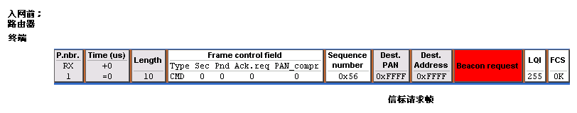
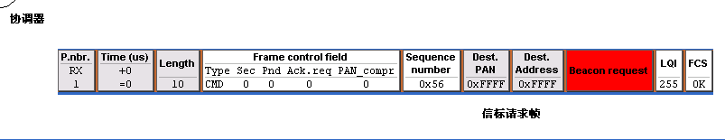

+++
author = "coucou"
title = "网络协议——Zigbee"
date = "2023-08-01"
description = "网络协议专题之Zigbee"
categories = [
    "网络协议"
]
tags = [
    "网络协议","Zigbee"
]
+++


## Zigbee通信

### 1. 说明

#### 1.1 按网络功能划分，

* 协调器  (协调器模块在网络里的地址永远是0x0000)
* 路由器 
* 终端

#### 1.2 数据通信方式

 * 单播
  * 广播
  * 组播
  * 绑定

#### 1.3 组网要求

* 任何一个Zigbee模块要加入到某个网络，一定要一个处于该网络里的节点作为介绍人，并且这个介绍人不能是终端节点。在加入网络以后，介绍人节点和被介绍加入的节点互为父子关系，介绍人节点是被介绍加入节点的父节点，被介绍加入节点是介绍节点的子节点。

* 当被加入节点有多个介绍人可以选择加入的时候，根据相对于被加入节点的信号强度等一些其他的参数，选择最佳的介绍人节点加入。

### 2. 组网过程（每一帧）

#### 2.1 入网前

* 路由器

​	路由器在入网之前，一直发送信标请求帧，它的作用是，让在它附近的所有具备介绍人资格的节点，都回复信标帧，这些返回的信标帧被这个想要加入的无线模块拿到，通过这些信标帧，选出最佳介绍人节点，请求加入。

* 终端

​	它在入网前的行为和下载了路由器代码模块在入网前行为是一样的。



* 协调器

​	发送了一帧信标请求帧，发送这一帧也会得到周围具备介绍人资格的节点回复信标帧，但是协调器拿到这些信标帧，用来判断周围的环境情况，为创建网络做准备。

​	当协调器创建成功以后，就会发送一个数据帧，这个帧里面可以看到协调器的地址0x0000,PANID,可以把这个帧叫做网络连接状态帧。



 #### 2.2入网到稳定工作

* 路由器

1. 协调器发出的网络连接状态帧，表明协调器稳定工作，与路由器入网无关

2. 路由器模块发出的信标请求帧，用于发现周围的网络，请求加入

3. 协调器模块发出的信标请求帧，路由器模块在拿到这个帧之后，可以得到协调器模块相对于它自己的信号强度，判断是不是最佳介绍人。

   4-5. 

   6-7.  重复2-3的过程

补充：

 在Zigbee网络里，如果一个模块发出的射频帧，非常明确的指定接收目标节点的地址，那么目标节点在接收到这个帧以后，硬件会自动回复一个ACK，表明已经收到了。

8. 是路由器模块发给协调模块，这个帧的作用是，在前面路由器模块收到了协调器模块的信标帧，通过信标帧判断协调器是当前路由器模块的最佳介绍人，路由器模块发送这一帧是告诉协调器，你是我当前的最佳介绍人，请你从当我入网的介绍人，介绍我入网，并且在这个帧携带了自己MAC,这个MAC地址是介绍人模块（协调器模块）给被介绍人模块（路由器模块）分配网络的地址的依据。

9. 是协调器模块硬件回复给路由器模块的ACK，表明我已经收到了你发过来的帧

10. 是路由器模块发给协调器模块的帧，请求协调器，把你根据我前面发给你的MAC地址给我分配的网络地址现在发给我。是一个数据请求帧。

11. 协调器回复给路由器的ACK表明收到了路由器发过来的帧

12. 协调器把为路由器分配好的网络地址发给路由器。而这个帧需要非常明确的发给路由器模块，但是路由器模块还不知道自己的网络地址是多少，所有在指定目标地址的时候用MAC地址

13. 在路由器模块根据自己的MAC地址收到了协调器发过来分配给自己的网络地址，硬件自己回复ACK，表明已经收到了，

14. 入网宣告，告诉当前网络里所有的节点，我入网了，我的网络地址是0xE9EB。

15. 是协调器模块在收到了路由器模块发的入网宣告帧以后，转发的帧。

 16 17. 是协调器模块和路由器模块在工作稳定时，发出的网络连接状态帧。

 协调器和路由器在入网后，稳定工作时的行为是，每隔一段时间发一次网络连接状态帧，默认是15S

* 终端

  入网过程，终端的入网过程和路由器入网的过程，所有的行为都是一样的

* 终端.psd

16. 终端节点发送给它的父节点协调器的数据请求帧，为了告诉它的父节点，我还在线。
17. 协调器在收到终端发来的帧，硬件自动回复的ACK


### 3.  PANID网段值

* 非0xFFFF

路由器和终端:  我必须要加入到PANID为参数值这样一个Zigbee无线局域网

协调器:  我要创建一个网络，并且把这个参数值作为这个网络的PANED

* 为0xFFFF

路由器和终端:  在加入网络的时候没有PANID的限制

协调器:  我可以随机生成一个值，把这个随机值作为这个网络的PANED

### 4. 事件和消息

#### 4.1 事件

​	在ZSTACK里按照代码按照功能来划分，分成不同的层，比如，硬件操作相关硬件层 网络相关的代码脚网络层 自己写应用程序部分叫应用层，几乎每一个层都是一个任务，系统为每一个任务分配一个一个字节的唯一数值编号，每一个任务都能处理一些他们能够处理的事，我们把这个数值编号叫做任务ID，它他们能够处理的事物叫做__事件__。

```c
uint8 osal_set_event( uint8 task_id, uint16 event_flag )

uint8 osal_start_timerEx( uint8 taskID, uint16 event_id, uint16 timeout_value )
```


​	在ZSTACK里，任务事件定义的特点决定了，每一个任务最多只能处理__16种__不同的事件，而系统在运行时候有许多事务需要处理，如果每一个实物处理都定义成1个事件，那么16种事件肯定是不够用，所有引入消息。

#### 4.2 事件原理

1. 系统在运行的时候会不断的去读应用层__任务事件变量__，当它发现这个变量为0就认为，应用层任务当前没有事件需要去处理; 如果发现这个变量不为0，它就认为应用层任务有事件将要去处理，它就会去调用应用层任务事件处理函数UINT16 SDApp_ProcessEvent( byte task_id, UINT16 events )，并且把任务事件变量的值传给events;在这个事件处理函数里，events;会分别和应用层定义的所有事件宏值进行与操作，如果发现那个为0，那么就去执行这个事件处理的相应代码。osal_set_event(SDApp_TaskID,SDApp_SEND_MSG_EVT);

2. 几乎每一个层都是一个任务，那么每一个层都有1个任务ID 任务事件处理函数 任务事件变量

   FUN函数数组={任务事件处理A,任务事件处理B,任务事件处理C..}

   Arr变量数组={任务事件变量a,任务事件变量b,任务事件变量c..}

3. 关注2个函数osal_init_system，在这个函数里的osalInitTasks，在这个函数里发现系统给所有任务分配任务ID.

   表示当前系统有tasksCnt个任务。

   osal_start_system(); 

   所有ZSTACK协议栈在稳定工作时，它行为是，__在for(;;){}死循环里，不断去读所有任务的任务事件变量__，如果发现所有任务的任务事件变量都为0，没问题，说明所有任务都没有事件将要去处理，再次重逢这个过程，直到发现某个任务事件变量不为0，就会通过不为0的这个任务ID找到这个任务事件处理函数，去处理相应的事件。

#### 4.2 消息

消息的处理事务的__原理__：

定义了一个事件#define SYS_EVENT_MSG        0x8000

当需要应用层任务来处理某个事务的时候，首先给应用层任务发送一个消息

```c
void osal_set_event(SDApp_TaskID, SYS_EVENT_MSG);
```

那么这样一来，应用层就会进入SYS_EVENT_MSG处理，在这个事件处理里判断到底刚刚引发我们产生SYS_EVENT_MSG事件是哪一种类型的消息，然后根据消息的类型做相应的处理。

而消息的类型可以自己定义，这样一来消息的类可以很多，那么应用层任务处理的事物种类就很多了。

### 5. 单播

#### 5.1 概述

​	发射模块非常明确知道接收模块的网络地址，以这个地址发送数据给接收模块，叫单播。

#### 5.2 数据接收处理函数

```c
void SDApp_MessageMSGCB( afIncomingMSGPacket_t *pkt )；
```

#### 5.3 端点 (Endpoint)

1. 他是一个字节编号的，数据收和发送的基本单元，在模块通信的时候，__发送模块必须指定收发双方模块的网络地址和端点__。

2. 端点要使用必须要和模块里的某个任务挂钩定义；

3. 一个端点只能挂钩在一个任务上，而一个任务可以挂钩多个端点，且端点对所有的任务是公用的，定义一个少一个。

4. 端点下还需要定义__簇__

```c
void SDApp_Init( byte task_id ) //定义了10号端点并且和这个模块的应用层任务挂钩
{
	// Fill out the endpoint description.

	SDApp_epDesc.endPoint = 10; //SDApp_ENDPOINT; 此端点编号为10

 	SDApp_epDesc.task_id = &SDApp_TaskID; 和我们应用层任务挂钩

 	SDApp_epDesc.simpleDesc = (SimpleDescriptionFormat_t *)&SDApp_SimpleDesc;//更加详细的描述这个端点一些情况就像我们定义一个编号房间，描述房间里大概有多少人之类的信息。

 	SDApp_epDesc.latencyReq = noLatencyReqs;//差不多

 	afRegister( &SDApp_epDesc );//这个函数必须要调用才能完成整个挂钩操作

}
```

#### 5.4 簇 (ClusterID)

1. 簇就是相当于端点房间里面的人，是接收最终的目标。这东西是2个字节编号，在射频发送的时候，必须要指定接收模块的镞，发送模块不需要指定。

```c
byte SDApp_TransID; // This is the unique message ID (counter) SDApp.c全局变量，记录我们引用层任务发送的数据包的个数。
void SDApp_Init( byte task_id )
{
 	SDApp_TransID = 0;
}

if(P0_1 == 0)
{
     char theMessageData[] ="Hello\r\n";
    
     SDApp_DstAddr.addrMode = (afAddrMode_t)Addr16Bit;  // 模式
     SDApp_DstAddr.addr.shortAddr = 0x0000;  //接收模块的网络地址

     SDApp_DstAddr.endPoint =SDApp_ENDPOINT ;//接收模块的端点房间号
    
     //SDApp_epDesc 结构体 端点描述符有源端点的信息
     AF_DataRequest( &SDApp_DstAddr, &SDApp_epDesc,

     				SDApp_CLUSTERID,//目标端点镞，房间里的接收人数据宏是1，2个字节，所以在射频0x0001

     				(byte)osal_strlen( theMessageData ) + 1,//发送字符串的长度

     				(byte *)&theMessageData,//字符串内容数组的首地址

    				&SDApp_TransID,
                    
     				AF_DISCV_ROUTE, AF_DEFAULT_RADIUS );
}
```

### 6. 广播

#### 6.1概述

1. 协调器创建网络之后，就和网络里的路由器节点在通信过程中、功能上没有任何区别，只不过网络地址有点特殊永远是0x0000，终端入网之后，他和网络里的其他节点数据收和发都要经过他的父节点转发。

2. 路由器在入网时候，虽然网络里也有他的父节点，有父子关系，但是他们发数据时候，不需要父节点转发，入网后，协调器和所有的路由器他们的通信地位是平等。

3. 目标地址为0XFFFF表示，这个数据包的目标模块是网络里的所有节点

4. 无线数据包的解析，网络源地址 网络目标地址，表示这个无线数据包的目的是从源地址 发送到目标地址；而在一个无线数据包里，前面的源地址 和目标地址代码 当前的这个无线数据包，是从哪个一个模块发出来，当前这个无线数据包要去哪一个节点。

 #### 6.2 实例化

```c
char theMessageData[] ="Hello\r\n";
    
SDApp_DstAddr.addrMode = (afAddrMode_t)AddBroadcast;  // 广播模式
SDApp_DstAddr.addr.shortAddr = 0xffff;  // 表示目标接收模块是所有节点

SDApp_DstAddr.endPoint =SDApp_ENDPOINT ;//接收模块的端点房间号
    
//SDApp_epDesc 结构体 端点描述符有源端点的信息
AF_DataRequest( &SDApp_DstAddr, &SDApp_epDesc,

     			SDApp_CLUSTERID,//目标端点镞，房间里的接收人数据宏是1，2个字节，所以在射频0x0001

     			(byte)osal_strlen( theMessageData ) + 1,//发送字符串的长度

     			(byte *)&theMessageData,//字符串内容数组的首地址

    			&SDApp_TransID,
                    
     			AF_DISCV_ROUTE, AF_DEFAULT_RADIUS );
```

### 7. 组播

#### 7.1 概述

1. 组播通信，在Zigbee网络，模块可以分组来标记，发送的模块如果发送的__组号__和网络里标记模块的组号相对应，那么这些模块就可以拿到这些无线数据包。

2. 分组中组编号是2个字节， 组都是和模块里已经定义了的端点相关联，如果我们说一个模块标记为组1，那么这个模块里至少有1个定义了的可用的端点和组0x0001相关联。

3. 发送的模块按照组的方式发送，需要指定的内容 目标模块的__组编号，端点，簇__，原则上只有当接收模块的这3个参数匹配上了，才能拿到和处理这样一个无线数据包

4. 组标记中，同一个模块定义的一个组个可以关联多个可用的端点，同一个端点下也可以关联多个组。

#### 7.2 实例

```c
// 发送模块
char theMessageData[] ="Hello\r\n";

SDApp_DstAddr.addrMode = (afAddrMode_t)AddrGroup; //发送模式是组播的方式

SDApp_DstAddr.addr.shortAddr = 0x0001; //接收模块的组编号

SDApp_DstAddr.endPoint =10 ;

AF_DataRequest( &SDApp_DstAddr, &SDApp_epDesc,

                0x0001,//接收模块的簇编号

                (byte)osal_strlen( theMessageData ) + 1,

                (byte *)&theMessageData,

                &SDApp_TransID,

                AF_DISCV_ROUTE, AF_DEFAULT_RADIUS );

 

// 协调器接收模块

#include"aps_groups.h" //用到了组相关的结构体，所有添加组头文件

aps_Group_t SampleApp_Group1;

aps_Group_t SampleApp_Group2;

 

// 按下按钮标记组
if(P0_1 == 0)
{//按钮3按下
     aps_RemoveGroup(10,0x0002); // 如果10号端点上关联了0x0002，那么就去掉组2个这个关联，如果根本没有关联，不做处理

     SampleApp_Group1.ID=0X0001; // 关联组

     aps_AddGroup( 10, &SampleApp_Group1 ); // 添加关联
}

if(0==P2_0)
{
     aps_RemoveGroup(10,0x0001);//如果10号端点上关联了0x0001，那么就去掉组1个这个关联，如果根本没有关联，不做处理
     SampleApp_Group2.ID=0X0002;
     aps_AddGroup( 10, &SampleApp_Group2 ); 
}

if(0==P0_5)
{
     aps_RemoveAllGroup(10);  // 移除所有关联
    
     SampleApp_Group1.ID=0X0001;
     aps_AddGroup( 10, &SampleApp_Group1 ); 
     SampleApp_Group2.ID=0X0002;
     aps_AddGroup( 10, &SampleApp_Group2 );      
 }

// 数据处理
if(0x0001==pkt->groupId)  // 找组
{
     if(10==pkt->endPoint)  // 找端点
     {
         switch ( pkt->clusterId )  // 找簇
         {
         	case 0x0001:
                // 数据处理
             break;
         }
      }
}
  
if(0x0002==pkt->groupId)
{
     if(10==pkt->endPoint)
     {
         switch ( pkt->clusterId )
         {
         	case 0x0001:
               // 数据处理
             break;
          }
     }
}


```


