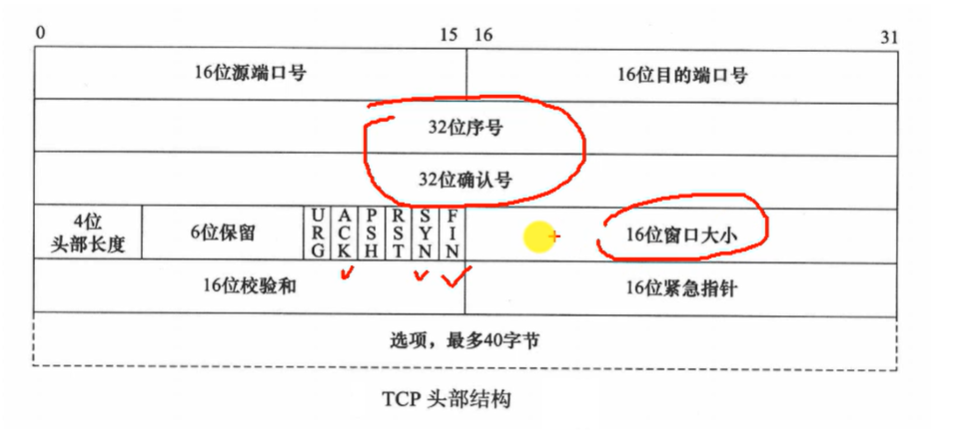
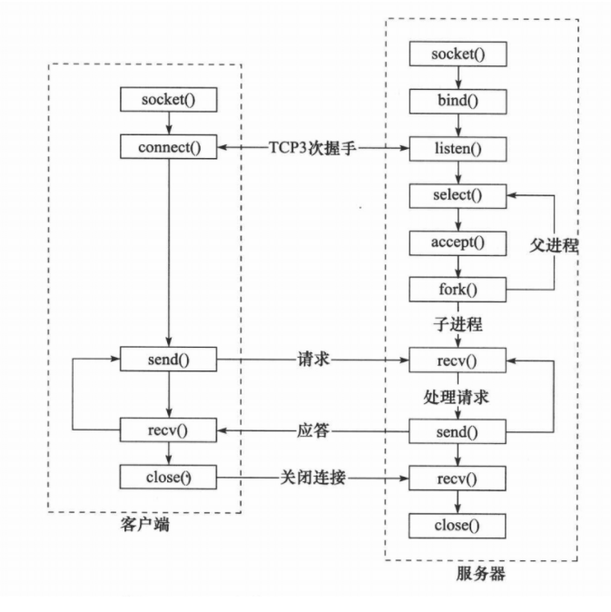
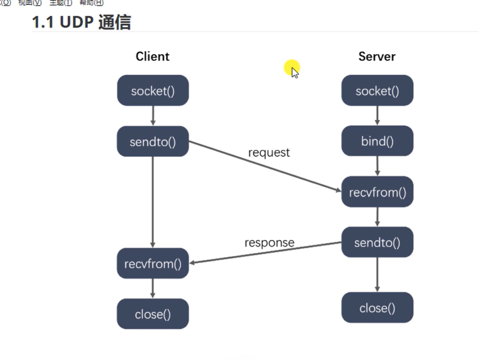
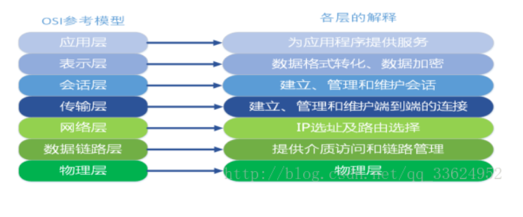
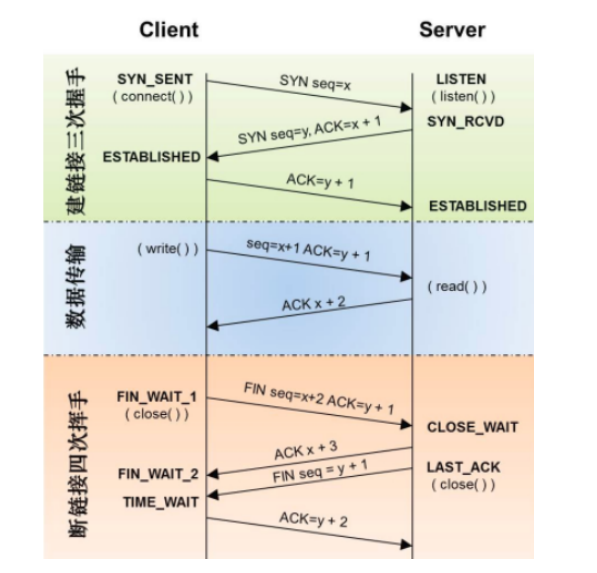
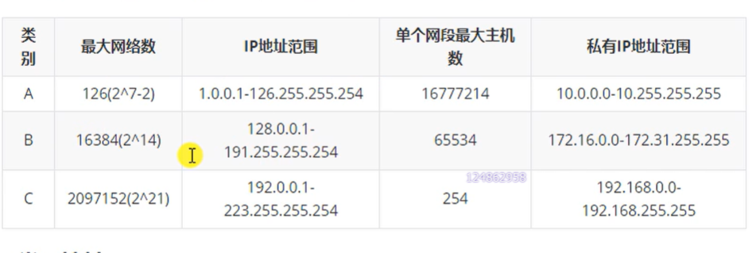

+++
author = "coucou"
title = "网络协议——TCP&UDP"
date = "2023-08-01"
description = "网络协议专题之TCP&UDP"
categories = [
    "网络协议"
]
tags = [
    "网络协议","TCP&UDP"
]
+++

## 网络协议——TCP&UDP

### TCP头部

### socket函数

>**服务器端函数**：
>
>（1）socket创建一个套接字
>
>（2）bind绑定ip和port
>
>（3）listen使套接字变为可以被动链接
>
>（4）accept等待客户端的链接
>
>（5）write/read接收发送数据
>
>（6）close关闭连接
>
>**客户端函数**：
>
>（1）创建一个socket，用函数socket()
>
>（2）bind绑定ip和port
>
>（3）连接服务器，用函数connect()
>
>（4）收发数据，用函数send()和recv()，或read()和write()
>
>（5）close关闭连接

### UDP

### 网络七层模型

### TCP建立和断开过程

> **三次握手和四次挥手**

### TCP如何保证可靠性

>**检验和**：
>
>通过检验和的方式，接收端可以检测出来数据是否有差错和异常，假如有差错就会直接丢弃TCP段，重新发送。TCP在计算检验和时，会在TCP首部加上一个12字节的伪首部。检验和总共计算3部分：TCP首部、TCP数据、TCP伪首部
>
>**序列号/  确认应答、超时重传**
>
>数据到达接收方之后，接收方会发送一个确认应答，表示已经收到数据段，并且确认序号会说明了它下一次需要接收的数据序列号，如果发送方没收到确认应答，那么发送方方会进行重发，这个等待时间一般是2*RTT（往返时间）+一个偏差值,如果一个包多次重发没有收到接收端的确认包，就会强制关闭连接
>
>**窗口控制与重发控制/快速重传(重复确认应答)**
>
>TCP会利用窗口控制来提高传输速度，意思是在一个窗口大小内，不用一定等到应答才能发送下一段数据，窗口大小就是无需等待确认而可以继续发送数据的最大值，如果不使用窗口控制，每一个没收到应答的数据都要重发

### TCP 滑动窗口以及重传机制

>1）滑动窗口协议是传输层进行流控的一种措施，接收方通过通告发送方自己的窗口大小，从而控制发送方的发送速度，从而达到防止发送方发送速度过快而导致自己被淹没的目的。滑动可以理解为缓冲区的大小，告诉发送方，自己还能接受多少数据，TCP的滑动窗口解决了端到端的流量控制问题，允许接受方对传输进行限制，直到它拥有足够的缓冲空间来容纳更多的数据。
>
>2）TCP在发送数据时会设置一个计时器，若到计时器超时仍未收到数据确认信息，则会引发相应的超时或基于计时器的重传操作，计时器超时称为重传超时（RTO） 。另一种方式的重传称为快速重传，通常发生在没有延时的情况下。若TCP累积确认无法返回新的ACK，或者当ACK包含的选择确认信息（SACK）表明出现失序报文时，快速重传会推断出现丢包，需要重传。

### TCP 慢启动

>慢启动（Slow Start），是传输控制协议（TCP）使用的一种阻塞控制机制。慢启动也叫做指数增长期。慢启动是指每次TCP接收窗口收到确认时都会增长。增加的大小就是已确认段的数目。这种情况一直保持到要么没有收到一些段，要么窗口大小到达预先定义的阈值。如果发生丢失事件，TCP就认为这是网络阻塞，就会采取措施减轻网络拥挤。一旦发生丢失事件或者到达阈值，TCP就会进入线性增长阶段。这时，每经过一个RTT窗口增长一个段

### Tcp为什么比UDP可靠

>**1.确认和重传机制**
>
>主要还三次握手和四次挥手
>
>**2.数据排序**
>
>TCP有专门的序列SN字段，可提供re-order
>
>**3.流量控制**
>
>窗口和计时器的使用，TCP窗口中指明双方能够接发的最大数据数量
>
>**4.拥塞控制**
>
>TCP的拥塞控制由4个核心算法组成，“慢启动”，“拥塞避免”，“”快速重传，“快速恢复”

### IPv4和IPv6的区别

>**1）协议地址的区别**
>
>地址长度：IPv4协议具有32位（4字节）地址长度；IPv6协议具有128位（16字节）地址长度
>
>地址的表示方法：IPv4地址是以小数表示的二进制数。 IPv6地址是以十六进制表示的二进制数。
>
>**2）地址解析协议**
>
>IPv4协议：地址解析协议（ARP）可用于将IPv4地址映射到MAC地址。
>
>IPv6协议：地址解析协议（ARP）被邻居发现协议（NDP）的功能所取代。
>
>**3）身份验证和加密**
>
>**IPv6****提供身份验证和加密，但IPv4不提供。**
>
>**4）数据包的区别**
>
>包的大小：IPv4协议的数据包最小值为576个字节；IPv6协议的数据包最小值为1280个字节。
>
>包头：IPv4长度为20~40字节；IPv6固定40字节。

### IP地址

