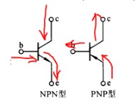

+++
author = "coucou"
title = "硬件——模拟电路"
date = "2023-08-01"
description = "硬件专题之模拟电路"
categories = [
    "硬件"
]
tags = [
    "硬件","模拟电路"
]
+++

# 模拟电路

## 第一章 半导体器件

### 本征半导体

>1、本征半导体：纯净的，具有完整晶体结构的半导体。在一定温度下，本征半导体内最重要的物理现象是本征激发（又称热激发），产生两种带电性质向相反的载流子（空穴和自由电子对），温度越高，本征激发越强。
>2、空穴是半导体中的一种等效+q的载流子。空穴导电的本质是价电子依次填补本征晶体中空位，使局部显示+q的空位宏观定向运动。
>3、在一定温度下，自由电子和空穴在热运动中相遇，使一对自由电子和空穴消失的现象称为复合。当热激发和复合相等时，称为载流子处于动态平衡状态。
>4、单质半导体材料是具有四价共价键晶体结构的硅Si和锗Ge。

### 杂质半导体

>1、P(**positive**)型半导体：在本征半导体中掺入微量的3价元素如硼B（多子是空穴，少子是电子）
>
>2、N(**negative**)型半导体：在本征半导体中掺入微凉的5价元素如磷P（多子是电子，少子是空穴）。

### PN结

>1、PN结中存在由N区指向P区的内建电场（因为多子的扩散使得不可移动的离子显性，P区是负离子，N区是正离子，所以内建电场由N区指向P区），阻止结外两区的多子的扩散，有利于少子的漂移。
>2、PN结具有单向导电性：正偏导通，反偏截止，是构成半导体器件的核心器件。

### 半导体二极管

>1、稳压二极管，是利用二极管在反向电压作用下的齐纳击穿（崩溃）效应，制造而成的一种具有稳定电压功能的电子技术组件，因此又称为“稳压管”。
>
>2、发光二极管（英语：Light-emitting diode，缩写为LED）是一种能发光的半导体电子元件，透过三价与五价元素所组成的复合光源。
>
>3、光电二极管（英语：photodiode ）是一种能够将光根据使用方式，转换成电流或者电压信号的光探测器。
>
>4、肖特基二极管（又译萧特基二极管）是一种导通电压降较低、允许高速切换的二极管，是利用肖特基势垒特性而产生的电子元件

### 晶体三极管

>1、放大原理
>
>NPN型双极性晶体管可以视为共用阳极的两个二极管接合在一起。在双极性晶体管的正常工作状态下，发射结（基极与发射极之间的PN结）处于正向偏置状态，而集电结（基极与集电极之间的PN结）则处于反向偏置状态。在没有外加电压时，发射结N区的电子（该区域的多数载流子）浓度大于P区的电子浓度，部分电子将扩散到P区。
>
>pnp其实和npn完全相反，体现在发射极比基极电压要高，基极比集电极电压要高，也就是发射极接高电压，集电极接低电压，有的地方，集电极接负电压
>
>

### MOS场效应管

>1、MOS工作在导通区或者截止区的时候可以当开关使用。外加[PWM](https://www.eefocus.com/baike/519198.html)信号可以用于调压，电机调速等方面。
>
>2、几个MOS管搭配可以起到单向导通的作用(类似[二极管](https://www.eefocus.com/baike/512433.html)单向导通)，比二极管有优势的地方是压降小、功耗低，导通电流大。低电压大电流的情况下优势更明显;
>
>3、工作在[可变电阻](https://www.eefocus.com/baike/1447641.html)区的时候可以当一个电阻使用，一般[集成芯片](https://www.eefocus.com/baike/1351565.html)中的电阻就是使用这种方式的电阻，优势是生产方便，体积小巧。
>
>4、工作在可变电阻区还可以起到放大的作用，与三极管放大电路类似。

## 第二章 基本放大电路

* 放大的概念

>- 放大电路放大的**本质**是**能量的控制和转换**
>- 电子电路的**基本特征**是**功率放大**
>- 能够**控制能量的元件**称为**有源元件**
>- 放大的**前提**是**不失真**，只有在不失真的情况下放大才有意义
>- 任何稳态信号都可以分解为若干频率正弦信号（谐波）的叠加，所以放大电路常以正弦波作为测试信号

* 放大电路的主要性能指标

>1. 放大倍数
>2. 输入电阻
>3. 输出电阻
>4. 通频带，衡量放大电路对不同频率信号的放大能力
>5. 非线性失真系数
>6. 最大不失真输出电压
>7. 最大输出功率和效率

## 第三章 多级放大电路

## 第四章 集成运算放大电路

* 集成运放的电路结构特点

> 1. 因为硅片上无法制作大电容，所以集成运放采用直接耦合方式
> 2. 因为相邻元件具有良好的对称性，所以电路采用各种差分放大电路（作输入级）和恒流源电路（做偏置电路或有源负载）
> 3. 允许复杂的电路形式
> 4. 硅片上不宜制作高阻值电阻，所以用有源元件（晶体管或场效应管）取代电阻
> 5. 常采用复合形式
>
>
>  
