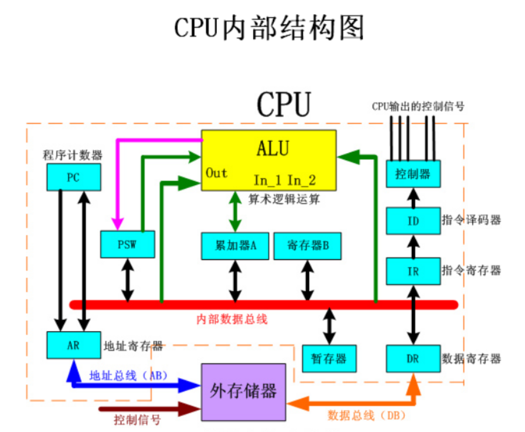
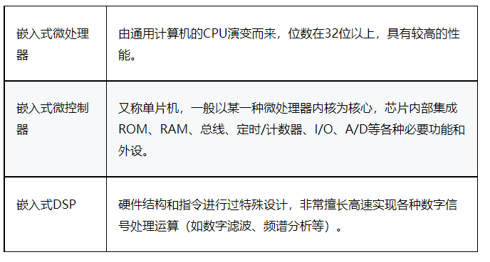

+++
author = "coucou"
title = "硬件——处理器&架构"
date = "2023-08-01"
description = "硬件专题之处理器&架构"
categories = [
    "硬件"
]
tags = [
    "硬件","处理器&架构"
]
+++

## 硬件——CPU

### CPU内部结构

> 控制单元、存储单元、运算单元、时钟

### CPU、内存、虚拟内存、硬盘的关系

> 1.cpu: cpu是从内存或者缓存中拿到指令，放入寄存器，并对指令译码分解成一系列微操作，，然后发出控制命令，执行微操作
>
> 2.问题1：CPU并不能直接调用存储在硬盘上的系统、程序和数据，所以必须先将硬盘上的数据、内容存储在内存中，这样才能被CPU读取，所以内存是硬盘和CPU的中转站
>
> 3.问题2：内存一般是比较小的，当内存超出额度之后，就会把硬盘上的部分空间模拟成内存----->虚拟内存，将暂时不用的数据或程序保存到虚拟内存，等到需要的时候再调用
>
> 总结：CPU是工厂，内存是中转站，硬盘是仓库，虚拟内存是临时中转站

### ARM结构处理器分类

> Cortex-M3和Cortex-M4可以同时支持小端模式和大端模式

> 1.嵌入式微处理器 ------>具有32位以上的处理器
>
> 2.嵌入式微控制器 -------->单片机，以某种微处理器内核为核心，芯片内部集成ROM，RAM等功能
>
> 3.嵌入式DSP处理器------>擅长数字信号处理

### 嵌入式微处理器和嵌入式DSP区别

> 偏重的方向不一样，微处理器偏向于界面的操作，他的速度和，计算能力一般，一般使用在消费电子方面
>
> DSP的计算能力较强，对于数据的处理能力极好，所以一般用作计算，比如军用，伺服电机

### CPU指令集

> **CISC**（Complex Instruction Set Computer）复杂指令集
>
> 特点：指令系统的指令不等长，指令的数目非常多
>
> **RISC**（Reduced Instruction Set Computing）是“精简指令集
>
> 特点：采用RISC指令集的微处理器处理能力强，并且采用超标量和超流水线结构，大大增强了并行处理能力

### CPU的流水线工作原理

> CPU执行一条指令时，也分为几个步骤，如
>
> 指令取指（InstrucTIon Fetch）-----> 指令译码（InstrucTIon Decode）-----> 指令执行（Execute）------- > 访存（Memory Access）-----> 写回（Write-Back），
>
> **重点：CPU****并不会等一条指令完全执行完才执行下一条指令，而是像流水一样**

### 嵌入式流水线工作

> 嵌入式CPU为了提高效率，采用超流水线结构，我们知道，CPU执行一条指令被分成5个步骤，每个步骤可能都需要1ns，但是有个长指令，被分成5个步骤时，指令执行这个步骤却需要2ns,那么整个时间就被限制了
>
> 为了提高效率，我们可以把指令执行（Execute）这个步骤再拆分成两组（寄存器+组合逻辑），每组执行时间为1ns，这样我们的普通流水线成了六级流水线了，这就是超流水线

