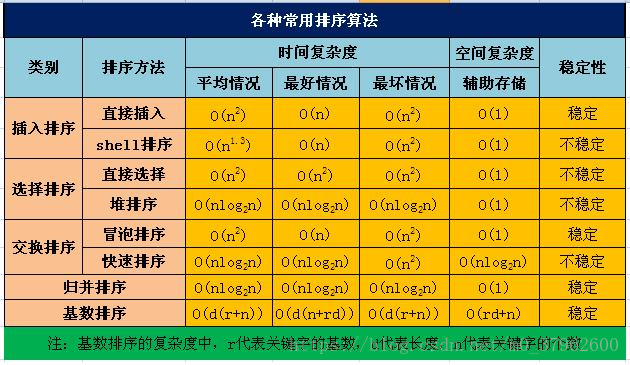

+++
author = "coucou"
title = "数据结构——理论"
date = "2023-08-01"
description = "数据结构专题之理论"
categories = [
    "数据结构"
]
tags = [
    "数据结构","理论"
]
+++

## 数据结构——理论

### 排序算法

### 数组和链表的区别

>数组不允许 动态定义数组大小，使用前必须定义其大小；链表采用动态分配内存的方式，需要时分配内存空间，不需要时释放空间，不会造成内存的浪费。
>
>从逻辑结构上来看：数组的大小一旦定义就不能改变，不能适应数据动态增减的情况；链表进行动态存储分配，可以适应数据动态的增减情况，可以方便插入删除数据
>
>从存储角度来看：数组从栈中分配空间，对程序员方便快速，单自由度小；链表是从堆中分配空间，自由度大，但申请管理比较麻烦。
>
>访问：数组在内存中是连续的，可用下标索引进行访问，链表是链式存储结构，访问元素时只能通过线性顺序由前向后顺序访问

### 栈和队列的区别

>a，规则：栈  后进先出，队列：  先进先出（fifo）；
>
>b，插入删除操作限定不同：栈：只能在一端插入删除；队列：在一端插入，在另一端删除。
>
>c，遍历数据的速度不同：栈：只能从栈顶取数据，最先进入栈底的需要遍历整个栈才能取出来，而且在遍历数据的同时，需要为数据开辟临时空间，保持数据在遍历前的一致性。队列：基于地址指针进行遍历，而且可以从头部或者尾部进行遍历，但不能同时遍历，遍历速度快。

### 二叉树

>**树的遍历**
>
>中序遍历、先序遍历、后序遍历、层次遍历
>
>**搜索二叉树（二叉排序树）**
>
>根结点的左孩子小于根结点，并却右孩子大于根节点，所以，搜索二叉树的中序遍历就是一个有序的
>
>**平衡二叉树**
>
>若二叉树的所有节点的左右子子树的高度差最多相差1，这样的二叉树就是平衡二叉树
>
>最小二叉平衡树的**节点总数**的公式如下 F(n)=F(n-1)+F(n-2)+1 这个类似于一个递归的数列，可以参考Fibonacci(斐波那契)数列，1是根节点，F(n-1)是左子树的节点数量，F(n-2)是右子树的节点数量
>
>**红黑树**
>
>

### 查找

>1. 线性查找（Linear Search）：逐个遍历待查找的元素，直到找到目标元素或遍历完整个数据集。
>2. 二分查找（Binary Search）：对于已排序的数据集，通过比较目标元素与中间元素的大小关系，将查找范围逐渐缩小一半，直到找到目标元素或确定目标元素不存在。
>3. 插值查找（Interpolation Search）：针对有序数据集，根据目标元素在数据集中的大致位置，使用插值公式计算出一个估计的位置，并根据估计位置进行查找。
>4. 哈希查找（Hashing Search）：通过哈希函数将元素映射到一个特定的索引位置，从而实现快速查找。需要在数据集中构建哈希表来支持查找操作。
>5. 二叉搜索树查找（Binary Search Tree Search）：基于二叉搜索树数据结构，根据目标元素与当前节点的大小关系，递归地在左子树或右子树中进行查找。
>6. B树查找（B-Tree Search）：基于B树数据结构，通过多次比较和分裂操作，将待查找的元素定位到B树中的叶子节点。
>7. 跳表查找（Skip List Search）：基于跳表数据结构，通过层级索引的方式，快速定位目标元素所在的位置。
>8. Trie（前缀树）查找：用于字符串查找，通过构建Trie树（前缀树），根据待查找的字符串逐层匹配Trie树的节点，最终确定是否存在目标字符串。

