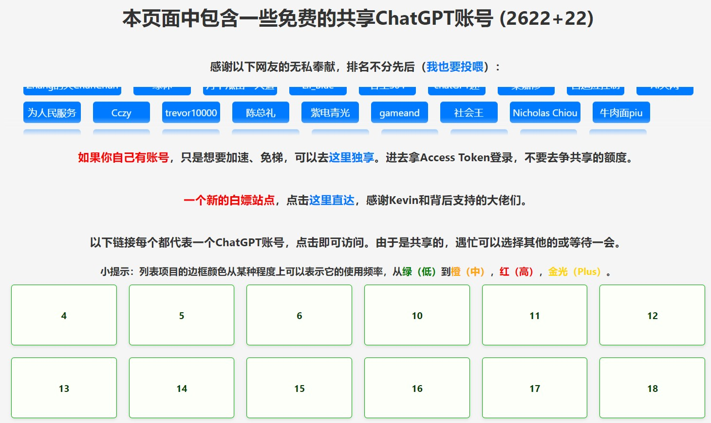
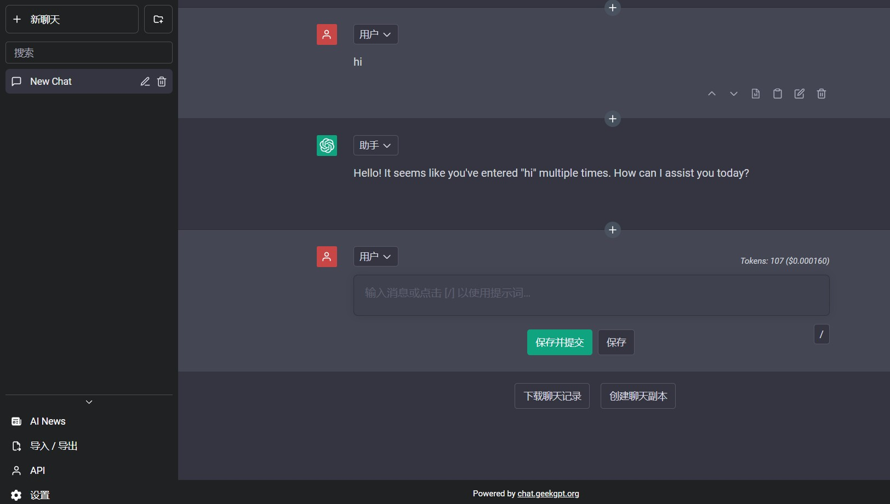
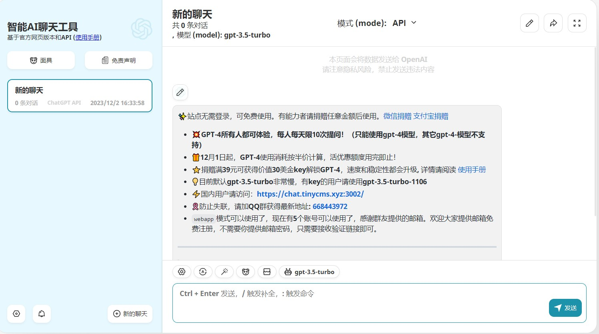

+++
author = "coucou"
title = "AI类资源合集"
date = "2023-12-01"
description = "这是所有的AI类资源合集，里面有资源地址以及视频说明"
categories = [
    "AI类资源合集"
]
tags = [
    "AI类资源合集"
]
image = "1.jpg"

+++

# AI类资源合集（全部免费，持续更新）

## 说明

>**全部免费！无任何套路！无任何套路！无任何套路！**
>
>有些资源可能随时会挂掉，毕竟是免费的，懂得都懂，可以私信我更新资源
>需要什么资源，可以后台私信我，更新资源，尽量满足
>
>**喜欢的可以订阅合集，你们的点赞、投币、收藏、转发，就是我更新的最大动力**

## AI文本（ChatGPT 3.5）

* https://chat-shared3.zhile.io/shared.html?v=2    

> 2023.12.3更新
>
> 注：至今可用，**免费**，**无需魔法**，不同账号速度不同

* https://chat1.geekgpt.org/   

> 2023.12.3更新
>
> 注：至今可用，**免费**，**无需魔法**，速度快，偶尔不可用

* https://chat.tinycms.xyz:3002/ 

  > 2023.12.3更新
  >
  > 注：至今可用，**免费**，**无需魔法**，速度快

>**工作学习**中常用

## AI绘图

* Stable Diffusion

待更新

## AIPPT

待更新

## AI视频

待更新

## AI音频

待更新
